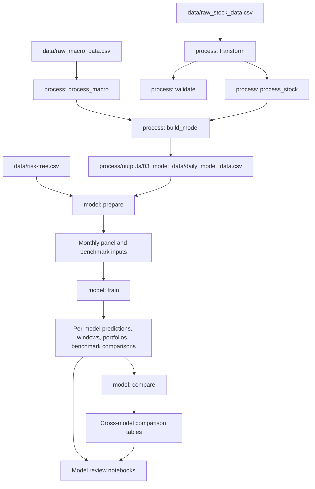

# Architecture

This document describes the current `version_2` system architecture: where data enters the project, how it moves through the `process` and `model` pipelines, which files form the handoff contracts, and what each stage is responsible for.

## System Goal

The repository is designed to answer one practical question:

Can a broad daily Vietnam equity dataset be transformed into a monthly cross-sectional panel that supports rolling stock-ranking models, portfolio backtests, and latest-month recommendation tables?

The architecture deliberately separates:

- `process`: build a broad, reusable daily stock-macro handoff
- `model`: decide the investable universe, engineer monthly features, train rolling models, and compare strategies

## High-Level Diagram



## Directory-Level Data Flow

| Layer | Main files | Role |
| --- | --- | --- |
| Raw inputs | `data/raw_stock_data.csv`, `data/raw_macro_data.csv`, `data/risk-free.csv` | Vendor-sourced local inputs used to run the project. |
| Daily process outputs | `process/outputs/00_validation/*`, `01_stock/*`, `02_macro/*`, `03_model_data/*` | Quality checks, cleaned stock data, cleaned macro data, and the stock-macro handoff file. |
| Monthly prepared model inputs | `model/data/panel_input.csv`, `benchmark_monthly.csv`, summary CSVs | Monthly panel used by the modeling code before timestamped run output is created. |
| Timestamped model runs | `model/outputs/run_*/...` | Immutable run directory with model outputs, portfolio tables, benchmark comparisons, and manifests. |
| Human review layer | `model/notebooks/*.ipynb`, `process/notebooks/*.ipynb` | Research notebooks for reviewing saved outputs and latest-month recommendations. |

## Execution Entry Points

| Pipeline | CLI entrypoint | Main orchestrator | Notes |
| --- | --- | --- | --- |
| `process` | `process/run_process.py` | `process/src/v2_process/runner.py` | Executes stages in fixed order: `transform -> validate -> process_stock -> process_macro -> build_model`. |
| `model` | `model/run_model.py` | `model/src/v2_model/pipeline.py` | Executes logical blocks: `prepare`, `train`, `compare`. |

## Process Pipeline Contracts

The `process` pipeline creates a broad daily panel and persists stage outputs to `process/outputs/...`. Stage-to-stage coordination is done through a shared in-memory `context`, but the persistent CSV files are the real external contract.

### Process Stage Order

1. `transform`
2. `validate`
3. `process_stock`
4. `process_macro`
5. `build_model`

### Process Stage Details

| Stage | Implementation | Reads | Writes | Downstream contract |
| --- | --- | --- | --- | --- |
| `transform` | `process/src/v2_process/stages/transform_stock.py` | `data/raw_stock_data.csv` | `_intermediate/stock_transformed.csv` | Standardizes stock columns and engineers first-pass stock features such as `bm`, `ep`, `cfp`, `mom*`, `turn`, `maxret`, and `idiovol`. |
| `validate` | `process/src/v2_process/stages/validate_raw.py` | transformed stock data, `data/raw_macro_data.csv` | `00_validation/raw_stock_summary.csv`, `raw_stock_missing_share.csv`, `raw_macro_missing_share.csv` | Produces audit tables; does not alter the core handoff data. |
| `process_stock` | `process/src/v2_process/stages/process_stock.py` | transformed stock data | `01_stock/clean_stock_daily.csv`, `clean_stock_summary.csv` | Rebuilds ticker calendars, computes `ret_1d`, adds `dollar_vol` and `adv_med`, forward-fills slow features with a freshness cap, and defines the cleaned daily stock contract. |
| `process_macro` | `process/src/v2_process/stages/process_macro.py` | `data/raw_macro_data.csv` | `02_macro/clean_macro_daily.csv`, `macro_missing_share.csv` | Filters macro columns, removes near-empty series, and forward-fills market-like series on the daily grid. |
| `build_model` | `process/src/v2_process/stages/build_model_data.py` | cleaned stock daily data, cleaned macro daily data | `03_model_data/macro_lagged_daily.csv`, `macro_release_lag_diagnostics.csv`, `daily_model_data.csv` | Applies release-lag logic, performs the as-of stock-macro merge, and produces the single daily handoff file consumed by the model pipeline. |

### Process Output Tree

```text
process/outputs/
  00_validation/
  01_stock/
  02_macro/
  03_model_data/
  _intermediate/
  _meta/
```

### Process Stable Handoff

The primary downstream contract is:

- `process/outputs/03_model_data/daily_model_data.csv`

This file is intentionally broad. It still contains many names and features that may later be dropped by the model-side investability and coverage rules.

## Model Pipeline Contracts

The `model` pipeline consumes the daily handoff, converts it into a month-end panel, applies model-side filtering, runs rolling backtests, and writes a timestamped run directory.

### Model Stage Details

| Stage | Implementation area | Reads | Writes | Downstream contract |
| --- | --- | --- | --- | --- |
| `prepare` | `model/src/v2_model/prepare_inputs.py`, `preprocess.py` | `process/outputs/03_model_data/daily_model_data.csv`, `data/risk-free.csv` | `model/data/panel_input.csv`, `benchmark_monthly.csv`, panel summaries, coverage summaries | Builds the monthly panel, monthly benchmark series, macro change features, ratios, growth terms, interactions, and the filtered training surface. |
| `train` | `model/src/v2_model/pipeline.py`, `models/*` | prepared monthly panel and benchmark inputs | `run_*/predictions`, `windows`, `portfolio`, `benchmark`, `importance`, `complexity`, `r2` | Runs each selected model independently on rolling windows for full, large, and small samples. |
| `compare` | `model/src/v2_model/compare.py` and `pipeline.py` | per-model run artifacts | `run_*/compare/*` | Merges model summaries, cumulative strategy tables, Diebold-Mariano results, and variable-importance comparisons after all selected single-model runs finish. |

### Model Run Structure

```text
model/outputs/run_<timestamp>/
  benchmark/
  compare/
  complexity/
  importance/
  meta/
  portfolio/
  predictions/
  preprocess/
  r2/
  windows/
```

### Model Stable Contracts

The main persistent contracts are:

- `model/data/panel_input.csv`: broad monthly panel before final run-specific output
- `model/data/benchmark_monthly.csv`: market benchmark series aligned to month-end
- `model/outputs/run_<timestamp>/meta/run_manifest.json`: audit trail for a specific model run

## Design Decisions

### 1. Liquidity filtering lives in `model`, not `process`

The daily `process` pipeline stays broad. Final universe selection happens in `model/src/v2_model/preprocess.py` using:

- `min_price`
- `min_me`
- `liquidity_category`
- `feature_profile`
- column coverage checks

This allows experiments to change the investable universe without rebuilding the daily stock-macro handoff.

### 2. Monthly panel engineering is centralized

`model/src/v2_model/prepare_inputs.py` converts the daily handoff to month-end data and creates:

- monthly returns and excess returns
- total-return momentum series
- macro change features
- market microstructure features
- raw ratios
- 12-month growth features
- interaction terms

That design keeps the `process` layer focused on reusable daily cleaning while keeping research-specific monthly feature construction close to the modeling code.

### 3. Rolling windows are the core evaluation unit

The model pipeline does not train once on the full sample. It builds rolling windows defined by:

- `train_months`
- `val_months`
- `test_months`
- `step_months`

Every window is fit independently, and the combined test-period predictions form the out-of-sample backtest used in the notebooks and comparison tables.

### 4. Each model is saved independently

Per-model outputs are written before cross-model comparison runs. That has two practical advantages:

- a failed model does not erase outputs from completed models
- a later rerun can target a subset of models without rebuilding every report

## Configuration Boundaries

| Concern | Config location | Examples |
| --- | --- | --- |
| Raw input and output paths | `process/configs/default.yaml`, `model/configs/*.yaml` | `input_daily_model_csv`, `input_risk_free_csv`, `output_dir` |
| Stock cleaning behavior | `process` config | `liq_win`, `stale_limit_days`, `min_rel` |
| Macro release timing | `process` config | `macro.release_lags` |
| Universe selection | `model` config | `min_price`, `min_me`, `liquidity_category` |
| Feature set | `model` config | `feature_profile = careful_v3` or `max_v3` |
| Rolling evaluation | `model` config | `train_months`, `val_months`, `test_months`, `step_months` |
| Portfolio reporting | `model` config | `n_deciles`, `cost_bps_list`, `benchmark_cost_bps` |

## Audit Trail And Reproducibility

Both pipelines leave an audit trail:

- the `process` pipeline always writes a manifest under `process/outputs/_meta/`
- the `model` pipeline always writes `run_<timestamp>/meta/run_manifest.json`
- preprocessing summaries and window maps are saved alongside model outputs
- notebooks review saved artifacts rather than inventing a separate reporting format

This makes it possible to trace a result back to:

- a config file
- a feature profile
- a window design
- a timestamped run directory

## Human Review Layer

The notebooks sit on top of the pipeline rather than replacing it:

- `process/notebooks/00_run_and_review_process.ipynb` reviews validation and handoff outputs
- `model/notebooks/00_run_and_review_model.ipynb` runs models and reviews saved run artifacts
- `model/notebooks/01_run_and_review_nn_architectures.ipynb` focuses on the neural network branch

The intended workflow is:

1. run the pipeline from the CLI
2. inspect saved artifacts in notebooks
3. export findings to README, reports, or external writeups

## Current Limitations

The architecture is intentionally pragmatic, but a few constraints remain:

- raw Bloomberg-derived data is local and not reproducible from inside the repo alone
- the `process` and `model` environments are still defined by lightweight `requirements.txt` files rather than a pinned lockfile
- CI and smoke-test automation are not yet part of the repository architecture

Those are engineering concerns around the current architecture, not contradictions in the data flow itself.
