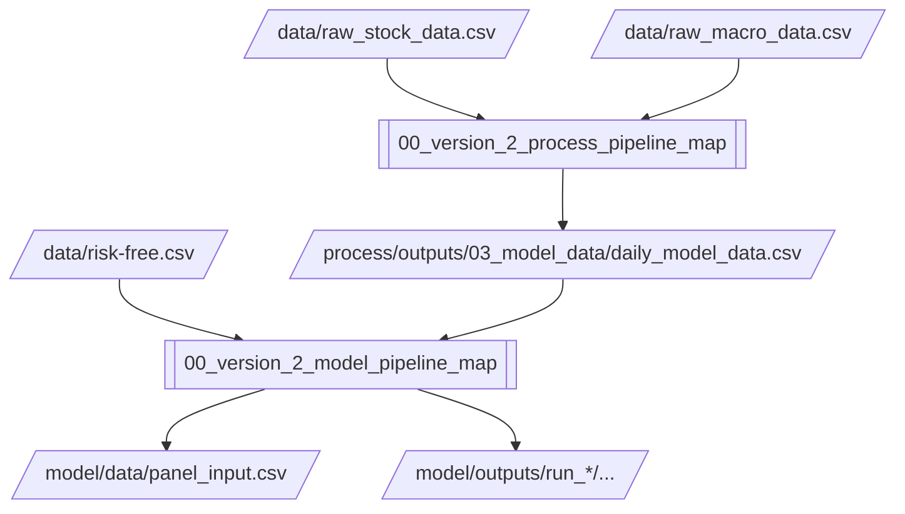

# Version 2 Documentation Home

## Summary
This note is the entry point for the `version_2` documentation set.

It connects three layers:
- `/data`: external inputs
- `/process`: daily stock and macro preparation
- `/model`: monthly preparation, rolling models, portfolio evaluation, benchmark comparison, and recommendations

## Start Here
- If you want the shortest overview: [Reader summary](01_version_2_reader_summary.md)
- If you want terminology first: [Glossary and notation](02_version_2_glossary_and_notation.md)
- If you want one concrete row to follow end to end: [Worked example](03_version_2_end_to_end_worked_example.md)
- If you want to decode the diagrams quickly: [Visual legend](04_version_2_visual_legend.md)
- If you want the document history: [Change log](05_version_2_change_log.md)

## Main Packs
- [Process pipeline map](version_2_process_docs/00_version_2_process_pipeline_map.md)
- [Model pipeline map](version_2_model_docs/00_version_2_model_pipeline_map.md)

## Reading Paths
### 1. Operator path
- [Reader summary](01_version_2_reader_summary.md)
- [Process README note](version_2_process_docs/01_README.md)
- [Model README note](version_2_model_docs/01_README.md)
- [Process config note](version_2_process_docs/03_configs_default_yaml.md)
- [Model config note](version_2_model_docs/03_configs_default_yaml.md)

### 2. Data path
- [Process pipeline map](version_2_process_docs/00_version_2_process_pipeline_map.md)
- [Process stock stage](version_2_process_docs/13_src_v2_process_stages_process_stock.md)
- [Build model-data stage](version_2_process_docs/15_src_v2_process_stages_build_model_data.md)
- [Monthly input preparation](version_2_model_docs/11_src_v2_model_prepare_inputs.md)
- [Monthly preprocessing](version_2_model_docs/12_src_v2_model_preprocess.md)

### 3. Modeling path
- [Model pipeline map](version_2_model_docs/00_version_2_model_pipeline_map.md)
- [Rolling windows](version_2_model_docs/10_src_v2_model_cv.md)
- [Model orchestration](version_2_model_docs/17_src_v2_model_pipeline.md)
- [Huber OLS](version_2_model_docs/20_src_v2_model_models_ols_huber.md)
- [Elastic Net](version_2_model_docs/22_src_v2_model_models_enet.md)
- [Neural network](version_2_model_docs/27_src_v2_model_models_nn.md)
- [Portfolio construction](version_2_model_docs/14_src_v2_model_portfolio.md)

## End-to-End Map

## Design Intent
- `/process` stays broad and daily.
- `/model` owns monthly eligibility, rolling validation, and economic evaluation.
- The documentation is split the same way.

## Linked Notes
- [Reader summary](01_version_2_reader_summary.md)
- [Glossary and notation](02_version_2_glossary_and_notation.md)
- [Worked example](03_version_2_end_to_end_worked_example.md)
- [Visual legend](04_version_2_visual_legend.md)
- [Change log](05_version_2_change_log.md)
- [Process pipeline map](version_2_process_docs/00_version_2_process_pipeline_map.md)
- [Model pipeline map](version_2_model_docs/00_version_2_model_pipeline_map.md)

