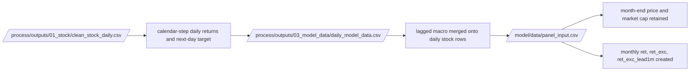

# Version 2 End-to-End Worked Example

## Summary
This note follows one real ticker, `AAA VM Equity`, from the daily clean stock panel to the merged daily model data and then into the monthly model panel.

## Why This Example Exists
The architecture notes explain the structure. This note shows what one real ticker actually looks like as it passes through the system.

## Stage 1: Clean Stock Daily Output
Source artifact: `/process/outputs/01_stock/clean_stock_daily.csv`

| Ticker | Date | Price | ret_1d | y_next_1d |
|---|---|---|---|---|
| AAA VM Equity | 2016-11-25 00:00:00 | 19940.323 | nan | -0.0167223971246605 |
| AAA VM Equity | 2016-11-28 00:00:00 | 19606.873 | -0.0167223971246605 | 0.0 |
| AAA VM Equity | 2016-11-29 00:00:00 | 19606.873 | 0.0 | 0.0 |
| AAA VM Equity | 2016-11-30 00:00:00 | 19606.873 | 0.0 | -0.0408163504705721 |
| AAA VM Equity | 2016-12-01 00:00:00 | 18806.592 | -0.0408163504705721 | 0.0 |

Interpretation:
- `ret_1d` is already calendar-step based
- `y_next_1d` is the next-day target carried back onto the current row
- this file is still daily and broad; no monthly eligibility or monthly liquidity filtering has happened yet

## Stage 2: Daily Model Data
Source artifact: `/process/outputs/03_model_data/daily_model_data.csv`

| Ticker | Date | Price | Market_Cap | ret_1d | US_FedFunds_Rate |
|---|---|---|---|---|---|
| AAA VM Equity | 2016-11-25 00:00:00 | 19940.323 | 1551809.5894 | nan | 0.5 |
| AAA VM Equity | 2016-11-28 00:00:00 | 19606.873 | 1525859.5963 | -0.0167223971246605 | 0.5 |
| AAA VM Equity | 2016-11-29 00:00:00 | 19606.873 | 1525859.5963 | 0.0 | 0.5 |
| AAA VM Equity | 2016-11-30 00:00:00 | 19606.873 | 1525859.5963 | 0.0 | 0.5 |
| AAA VM Equity | 2016-12-01 00:00:00 | 18806.592 | 1463579.6127 | -0.0408163504705721 | 0.5 |

Interpretation:
- the stock row now carries lagged macro context
- the handoff into `/model` is still daily
- the benchmark and risk-free are still not monthly at this point

## Stage 3: Monthly Panel Input
Source artifact: `/model/data/panel_input.csv`

| id | eom | prc | me | ret | ret_exc | ret_exc_lead1m | be_me | ret_12_1 |
|---|---|---|---|---|---|---|---|---|
| AAA VM Equity | 2016-11-30 00:00:00 | 19606.873 | 1525859.5963 | -0.0167223971246605 | -0.0170815853356124 | -0.2045083243098931 | 2.6379229188323186e-05 | nan |
| AAA VM Equity | 2016-12-31 00:00:00 | 15605.47 | 1214459.6786 | -0.2040816503478136 | -0.2045083243098931 | -0.0645145724663203 | 3.314313411080093e-05 | nan |
| AAA VM Equity | 2017-01-31 00:00:00 | 14605.119 | 1247533.2527 | -0.0641025871056744 | -0.0645145724663203 | 0.1411556611315008 | 3.652287416097986e-05 | nan |
| AAA VM Equity | 2017-02-28 00:00:00 | 16672.511 | 1424124.7177 | 0.1415525611259998 | 0.1411556611315008 | -0.0206827493105872 | 3.199403776488501e-05 | nan |
| AAA VM Equity | 2017-03-31 00:00:00 | 16339.061 | 1395642.2234 | -0.0199999868046267 | -0.0206827493105872 | 0.0524514889455991 | 3.3458145086956674e-05 | nan |

Interpretation:
- `Date` has become `eom`
- daily returns have been compounded into monthly `ret`
- `ret_exc` subtracts monthly risk-free
- `ret_exc_lead1m` is the actual prediction target used downstream

## End-to-End Flow

## What Changes at Each Boundary
| Boundary | What changes |
| --- | --- |
| clean stock -> daily model data | lagged macro state is added |
| daily model data -> panel input | daily rows collapse into stock-month rows |
| panel input -> preprocess | price / size / liquidity / coverage filtering and rank scaling occur |

## Linked Notes
- [Process stock stage](version_2_process_docs/13_src_v2_process_stages_process_stock.md)
- [Build model-data stage](version_2_process_docs/15_src_v2_process_stages_build_model_data.md)
- [Monthly input preparation](version_2_model_docs/11_src_v2_model_prepare_inputs.md)
- [Monthly preprocessing](version_2_model_docs/12_src_v2_model_preprocess.md)
