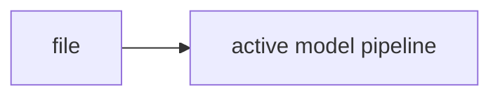

# README.md

## Purpose
Human-facing overview of the model pipeline, how to run it, and what artifacts it produces. Source: `/model/README.md`.

## Where it sits in the pipeline
This file supports the active model pipeline and is part of the maintained code path.

## Inputs
- Code-level inputs vary by caller; see the core code snippet below.
 
## Outputs / side effects
- Depends on caller; configuration, path resolution, testing, or derived tables depending on the file.
 
## How the code works
The file is part of the active `version_2/model` implementation and should be read together with the linked notes for the surrounding workflow.

## Core Code
```text
# Version 2 Model Pipeline

This pipeline reads the broad daily output from `../process`, prepares the monthly model panel, applies liquidity control, and runs the full model set.

## Inputs
- `../process/outputs/03_model_data/daily_model_data.csv`
- `../data/risk-free.csv`

## Outputs
- `data/panel_input.csv`
- `data/benchmark_monthly.csv`
- `data/panel_prep_summary.csv`
- `data/benchmark_prep_summary.csv`
- `data/window_coverage_summary.csv`
- `outputs/run_*/...`

## Run
```bash
cd model
pip install -r requirements.txt
python run_model.py --config configs/default.yaml --models all --stages all
```

Run one model:
```bash
python run_model.py --config configs/default.yaml --models ENET --stages all
```

Available models:
- `OLS`
- `OLS3`
- `ENET`
- `PLS`
- `PCR`
- `GBRT`
- `RF`
- `NN`

## Notebook
- `notebooks/00_run_and_review_model.ipynb`

## Google Colab
If the project lives in Google Drive, open:
- `model/notebooks/00_run_and_review_model.ipynb`

The notebook will:
- prefer `/content/drive/MyDrive/version_2/model`, then `/content/version_2/model`, then local fallback
- install `requirements.txt`
- let you run one model at a time
- show quick performance tables
- show and save the model's latest recommended stocks
```

## Math / logic
Use the linked notes for the main pipeline math. This file is mostly structural support around the active model workflow.

## Worked Example
Example: this file participates when the notebook calls the CLI or when the pipeline builds/validates rolling windows and output artifacts.

## Visual Flow


## What depends on it
- Other active files in `/model/src/v2_model` and the notebooks.

## Important caveats / assumptions
- This note focuses on the active code only. `model/not_working` is excluded from the maintained manuals.

## Linked Notes
- [Pipeline map](00_version_2_model_pipeline_map.md)
- [Pipeline orchestrator](17_src_v2_model_pipeline.md)

