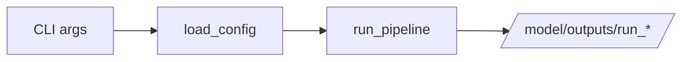

# run_model.py

## Purpose
Command-line entrypoint for the active model pipeline. Source: `/model/run_model.py`.

## Where it sits in the pipeline
This file is the outermost executable wrapper around `load_config(...)` and `run_pipeline(...)`. The notebooks call the same path through `subprocess`.

## Inputs
- `--config` path
- `--models` list
- `--stages` value such as `all`
- the active model package on `PYTHONPATH`

## Outputs / side effects
- prints the chosen output run directory
- triggers the full active model pipeline and its outputs under `/model/outputs/`

## How the code works
It resolves the project root, ensures the source directory is importable, parses CLI arguments, loads the config with `load_config(...)`, then calls `run_pipeline(...)` with the selected models and stages. The file is intentionally thin so notebooks and shell usage share the same implementation path.

## Core Code
```python
#!/usr/bin/env python3
from __future__ import annotations

import argparse
import sys
from pathlib import Path

ROOT = Path(__file__).resolve().parent
SRC = ROOT / 'src'
if str(SRC) not in sys.path:
    sys.path.insert(0, str(SRC))

from v2_model.config import DEFAULT_MODELS, load_config
from v2_model.pipeline import run_pipeline


def parse_args() -> argparse.Namespace:
    p = argparse.ArgumentParser(description='Version 2 model pipeline.')
    p.add_argument('--config', type=str, required=True)
    p.add_argument('--models', type=str, default='all')
    p.add_argument('--stages', type=str, default='all')
    return p.parse_args()


def main() -> None:
    args = parse_args()
    cfg = load_config(args.config)
    models = [m.strip() for m in args.models.split(',') if m.strip()]
    if len(models) == 1 and models[0].lower() == 'all':
        models = DEFAULT_MODELS
    stages = [s.strip() for s in args.stages.split(',') if s.strip()]
    run_dir = run_pipeline(cfg, models, stages, args.config)
    print(f'Pipeline completed. Outputs saved to: {run_dir}')


if __name__ == '__main__':
    main()
```

## Math / logic
There is no model math here; the file is orchestration only.

## Worked Example
Running `python run_model.py --config configs/careful_v3.yaml --models OLS --stages all` loads the `careful_v3` profile, prepares the monthly panel if needed, and writes a new run folder under `/model/outputs/`.

## Visual Flow


## What depends on it
- shell execution
- `/model/notebooks/00_run_and_review_model.ipynb`
- `/model/notebooks/01_run_and_review_nn_architectures.ipynb`

## Important caveats / assumptions
- The file assumes `PYTHONPATH=src` or equivalent package visibility.
- It does not implement any model logic itself.

## Linked Notes
- [Config loader](07_src_v2_model_config.md)
- [Pipeline orchestrator](17_src_v2_model_pipeline.md)
- [Main notebook](05_notebooks_00_run_and_review_model.md)

