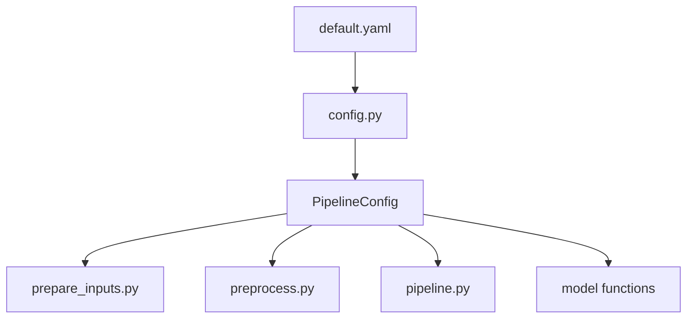

# default.yaml

## Purpose
Defines the default model-side runtime contract: where monthly inputs come from, how preprocessing filters are applied, and how each model family is tuned. Source: `/model/configs/default.yaml`.

## Where it sits in the pipeline
This file is the top-level configuration instance loaded by `/model/run_model.py` and parsed by `/model/src/v2_model/config.py`. The profile-specific configs include this file and override only `preprocess.feature_profile`.

## Inputs
- Nothing at runtime beyond the YAML file itself.
- Parsed into the `PipelineConfig` dataclass by `load_config(...)`.

## Outputs / side effects
No direct outputs. It changes the behavior of `/model/src/v2_model/prepare_inputs.py`, `/model/src/v2_model/preprocess.py`, model hyperparameter search, benchmark construction, and output routing.

## How the code works
The YAML is split into logical sections: `paths`, `prepare`, `preprocess`, `cv`, `portfolio`, `benchmark_compare`, `output`, and `models`. The active default currently uses `preprocess.feature_profile = careful_v3` and `preprocess.liquidity_category = broad_liquid_top50`.

## Core Code
```yaml
paths:
  input_daily_model_csv: ../process/outputs/03_model_data/daily_model_data.csv
  input_risk_free_csv: ../data/risk-free.csv
  prepared_panel_csv: ./data/panel_input.csv
  prepared_benchmark_csv: ./data/benchmark_monthly.csv
  prepared_panel_summary_csv: ./data/panel_prep_summary.csv
  prepared_benchmark_summary_csv: ./data/benchmark_prep_summary.csv
  window_coverage_summary_csv: ./data/window_coverage_summary.csv
  output_dir: ./outputs

prepare:
  rf_date_col: observation_date
  rf_value_col: DGS3MO

preprocess:
  min_price: 1000.0
  min_me: 100000.0
  liquidity_category: broad_liquid_top50
  feature_profile: careful_v3
  min_col_coverage: 0.75
  winsor_lower: 0.01
  winsor_upper: 0.99
  date_start: null

cv:
  train_months: 60
  val_months: 24
  test_months: 12
  step_months: 12

sampling:
  large_small_pct: 0.30

portfolio:
  n_deciles: 10
  cost_bps_list: [0, 10, 20, 30]
  benchmark_cost_bps: 30

runtime:
  seed: 42
  n_jobs: -1
  smoke_test: false
  run_variable_importance: true

models:
  ols:
    max_iter: 1000
  ols3:
    max_iter: 1000
    fixed_features: [me, be_me, ret_12_1]
  enet:
    alpha_start: 0.00001
    alpha_stop: 0.004
    alpha_num: 20
    l1_ratio: 0.5
    max_iter: 10000
  pls:
    components: [1,2,3,4,5,6,7,8,9,10,11,12,13,14,15,16,17,18,19]
  pcr:
    components: [1,2,3,5,7,9,11,15,17,22,25,29,33,40,45,49]
  gbrt:
    max_depth: [1,2,3,4,5,6,7,8]
    n_estimators: [100]
    learning_rate: [0.01, 0.1]
    max_features: [sqrt]
    min_samples_split: [5000, 8000, 10000]
    min_samples_leaf: [50, 100, 200]
    huber_delta: 1.35
  rf:
    max_depth: [1,2,3,4,5,6]
    max_features: [3, 6, 12, 24, 46, 49]
    n_estimators: 100
  nn:
    hidden_layer_grid:
      - [64]
      - [64, 32]
      - [64, 32, 16]
      - [64, 32, 16, 8]
    dropout_grid: [0.0, 0.1]
    learning_rate_grid: [0.001]
    weight_decay_grid: [0.00001, 0.0001]
    batch_size: 1024
    epochs: 80
    patience: 8
    device: cuda
```

## Math / logic
$$\text{{Monthly sample}} = \{(i,t): prc_{{i,t}} \ge \text{{min\_price}},\; me_{{i,t}} \ge \text{{min\_me}},\; \text{{liq\_rank}}_{{i,t}} \in \text{{top keep-share}}\}$$

$$R^2_{{OOS}} = 1 - \frac{\sum (y - \hat y)^2}{\sum y^2}$$

The YAML does not implement the math directly, but it sets the thresholds and grids that those formulas use.

## Worked Example
With the current default, a stock-month at `eom = 2026-02-28` only reaches the model if it passes the monthly price, size, and liquidity rules. If you switch from `careful_v3` to `max_v3`, the sample filters stay the same, but the optional predictor list gets much wider.

## Visual Flow


## What depends on it
- `/model/run_model.py`
- `/model/src/v2_model/config.py`
- `/model/src/v2_model/preprocess.py`
- `/model/src/v2_model/pipeline.py`
- notebooks in `/model/notebooks`

## Important caveats / assumptions
- The active default is `broad_liquid_top50`, not the earlier planning-note top-70 target.
- The two profile configs are the cleanest way to select `careful_v3` vs `max_v3`.

## Linked Notes
- [Pipeline map](00_version_2_model_pipeline_map.md)
- [Config loader](07_src_v2_model_config.md)
- [careful_v3 config](35_configs_careful_v3_yaml.md)
- [max_v3 config](36_configs_max_v3_yaml.md)
- [Feature profiles](34_src_v2_model_feature_profiles.md)

