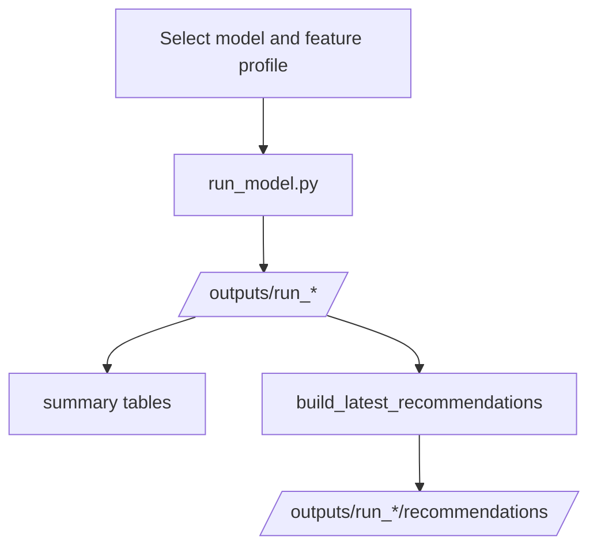

# 00_run_and_review_model.ipynb

## Purpose
Interactive control notebook for running one model at a time under `careful_v3` and `max_v3`, then reviewing summary outputs and latest fully labeled recommendations. Source: `/model/notebooks/00_run_and_review_model.ipynb`.

## Where it sits in the pipeline
This notebook is a wrapper around the active model CLI and recommendation helper. It is not the authoritative implementation path, but it is the main review surface for Colab and local use.

## Inputs
- Project root under `/content/drive/MyDrive/version_2/model` or `/content/version_2/model` or local fallback
- profile configs `careful_v3.yaml` and `max_v3.yaml`
- active outputs written under `/model/outputs/`

## Outputs / side effects
- Runs `run_model.py` for one selected model/profile
- Reads summary CSVs from the resulting run directory
- Writes latest recommendation CSVs into `run_*/recommendations/` using `build_latest_recommendations(...)`

## How the code works
The notebook mounts Drive when in Colab, resolves `ROOT`, selects config by feature profile, runs a single model through the CLI, then displays summary tables from the output bundle. Each model has six code blocks: run/summary/recommendation for `careful_v3`, then the same for `max_v3`. The active recommendation helper is `build_latest_recommendations(...)`; archived true-latest code exists under `/model/not_working`, but it is not part of this notebook.

## Core Code
```python
try:
    from google.colab import drive
    drive.mount('/content/drive')
except ModuleNotFoundError:
    pass

from pathlib import Path
import subprocess, sys, json
import pandas as pd
from IPython.display import display

root_candidates = [
    Path('/content/drive/MyDrive/version_2/model'),
    Path('/content/version_2/model'),
    Path.cwd().resolve().parents[0],
]
ROOT = next(path for path in root_candidates if path.exists())
AVAILABLE_PROFILES = ['careful_v3', 'max_v3']
DEFAULT_FEATURE_PROFILE = 'careful_v3'
print({'ROOT': str(ROOT), 'available_profiles': AVAILABLE_PROFILES, 'default_profile': DEFAULT_FEATURE_PROFILE})
ROOT

subprocess.run([sys.executable, '-m', 'pip', 'install', '-q', '-r', str(ROOT / 'requirements.txt')], check=True)
if str(ROOT / 'src') not in sys.path:
    sys.path.insert(0, str(ROOT / 'src'))

from v2_model.config import load_config
from v2_model.recommend import build_latest_recommendations

LAST_RUN_DIRS = {}

def _config_for_profile(feature_profile: str):
    cfg = ROOT / 'configs' / f'{feature_profile}.yaml'
    if cfg.exists():
        return cfg
    return ROOT / 'configs' / 'default.yaml'

def _run_key(model_name: str, feature_profile: str):
    return (model_name.upper(), feature_profile)

def _parse_run_dir(stdout_text: str):
    marker = 'Pipeline completed. Outputs saved to:'
    for line in reversed(stdout_text.splitlines()):
        if marker in line:
            return Path(line.split(marker, 1)[1].strip())
    return None

def _manifest_feature_profile(run_dir: Path):
    manifest = run_dir / 'meta' / 'run_manifest.json'
    if not manifest.exists():
        return None
    try:
        return json.loads(manifest.read_text()).get('feature_profile')
    except Exception:
        return None

def run_single_model(model_name: str, feature_profile: str = DEFAULT_FEATURE_PROFILE, stages: str = 'all'):
    config_path = _config_for_profile(feature_profile)
    cmd = [sys.executable, str(ROOT / 'run_model.py'), '--config', str(config_path), '--models', model_name, '--stages', stages]
    print('Running:', ' '.join(map(str, cmd)))
    proc = subprocess.Popen(cmd, cwd=ROOT, stdout=subprocess.PIPE, stderr=subprocess.STDOUT, text=True, bufsize=1)
    lines = []
    for line in proc.stdout:
        print(line, end='')
        lines.append(line.rstrip(''))
    rc = proc.wait()
    if rc != 0:
        raise RuntimeError(f'Model run failed with code {rc}')
    run_dir = _parse_run_dir(''.join(lines))
    if run_dir is None:
        raise RuntimeError('Could not parse run directory from command output.')
    LAST_RUN_DIRS[_run_key(model_name, feature_profile)] = run_dir
    return run_dir

def get_run_dir(model_name: str, feature_profile: str = DEFAULT_FEATURE_PROFILE):
    key = _run_key(model_name, feature_profile)
    if key in LAST_RUN_DIRS:
        return LAST_RUN_DIRS[key]
    candidates = sorted((ROOT / 'outputs').glob('run_*'))
    model_key = model_name.lower()
    for run_dir in reversed(candidates):
        if not (run_dir / 'r2' / f'{model_key}_r2_summary_full_large_small.csv').exists():
            continue
        if _manifest_feature_profile(run_dir) != feature_profile:
            continue
        LAST_RUN_DIRS[key] = run_dir
        return run_dir
    raise FileNotFoundError(f'No saved run found for {model_name.upper()} with profile {feature_profile}. Run the model first.')

def show_model_summary(model_name: str, feature_profile: str = DEFAULT_FEATURE_PROFILE):
    key = model_name.lower()
    run_dir = get_run_dir(model_name, feature_profile)
    print('Feature profile:', feature_profile)
    print('Run dir:', run_dir)
    display(pd.read_csv(run_dir / 'preprocess' / 'panel_prep_summary.csv'))
    display(pd.read_csv(run_dir / 'preprocess' / 'window_coverage_summary.csv'))
    display(pd.read_csv(run_dir / 'preprocess' / 'preprocess_report.csv'))
    display(pd.read_csv(run_dir / 'r2' / f'{key}_r2_summary_full_large_small.csv'))
    display(pd.read_csv(run_dir / 'portfolio' / f'{key}_performance_summary.csv'))
    display(pd.read_csv(run_dir / 'benchmark' / f'{key}_vs_benchmark.csv'))
    imp_path = run_dir / 'importance' / f'{key}_feature_importance.csv'
    if imp_path.exists():
        display(pd.read_csv(imp_path).head(15))
    comp_path = run_dir / 'complexity' / f'{key}_complexity.csv'
    if comp_path.exists():
        display(pd.read_csv(comp_path).head(15))

def show_latest_recommendations(model_name: str, feature_profile: str = DEFAULT_FEATURE_PROFILE, top_k: int = 10, save_to_run_dir: bool = True):
    cfg = load_config(_config_for_profile(feature_profile))
    result = build_latest_recommendations(cfg, model_name, top_k=top_k)
    print('Feature profile:', feature_profile)
    print('Latest fully labeled month scored:', result.latest_eom.date())
    print('Calibration window train:', result.train_start.date(), '->', result.train_end.date())
    print('Calibration window val  :', result.val_start.date(), '->', result.val_end.date())
    display(result.recommendations)
    if save_to_run_dir:
        run_dir = get_run_dir(model_name, feature_profile)
        out_path = run_dir / 'recommendations' / f"{model_name.lower()}_{feature_profile}_latest_recommendations.csv"
        out_path.parent.mkdir(parents=True, exist_ok=True)
        result.recommendations.to_csv(out_path, index=False)
        print('Saved:', out_path)

RUN_DIR_OLS_CAREFUL = run_single_model('OLS', feature_profile='careful_v3')
RUN_DIR_OLS_CAREFUL
```

## Math / logic
The notebook itself does not implement the models. It calls the CLI and then reads the same reported metrics used elsewhere:

$$R^2_{{OOS}} = 1 - \frac{\sum (y-\hat y)^2}{\sum y^2}$$

$$\text{{Sharpe}}_{{ann}} = \frac{\overline r}{\sigma(r)}\sqrt{{12}}$$

## Worked Example
If you run the `OLS careful_v3` section, the notebook will:
1. select `/model/configs/careful_v3.yaml`
2. run `run_model.py --models OLS`
3. read the resulting `r2`, `portfolio`, and `benchmark` summaries
4. call `build_latest_recommendations(...)` for the latest fully labeled month and save the CSV into that run folder

## Visual Flow


## What depends on it
This notebook depends on the active CLI and summary schema staying stable. It is the main practical entry point for Batch 3 experiments.

## Important caveats / assumptions
- The notebook uses latest fully labeled recommendations, not true-latest scoring.
- The notebook is profile-aware: every model section compares `careful_v3` and `max_v3` side by side.
- If you change output schema in the pipeline, the summary display cells must be updated too.

## Linked Notes
- [Pipeline map](00_version_2_model_pipeline_map.md)
- [CLI entrypoint](02_run_model.md)
- [Latest recommendation helper](16_src_v2_model_recommend.md)
- [careful_v3 config](35_configs_careful_v3_yaml.md)
- [max_v3 config](36_configs_max_v3_yaml.md)
- [NN architecture notebook](37_notebooks_01_run_and_review_nn_architectures.md)

