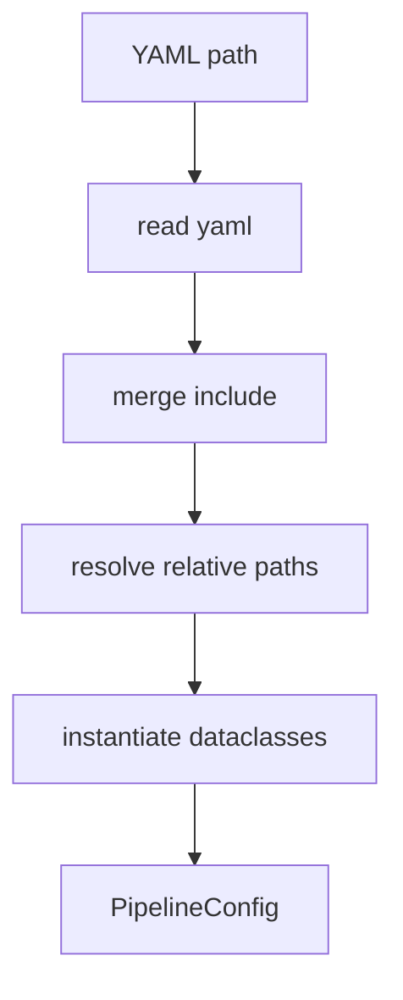

# config.py

## Purpose
Loads YAML config files, merges includes, resolves paths, defines typed config dataclasses, and centralizes feature-profile and liquidity settings. Source: `/model/src/v2_model/config.py`.

## Where it sits in the pipeline
This file is the configuration spine of the active model pipeline. Everything from the CLI to notebooks and model helpers relies on the `PipelineConfig` object it builds.

## Inputs
- one YAML file path
- optional included YAML files referenced by `include:`
- model package defaults and constants

## Outputs / side effects
- returns a populated `PipelineConfig`
- exposes `LIQUIDITY_KEEP_SHARE` and valid feature-profile names

## How the code works
The loader reads a YAML file, recursively merges any included parent config, resolves relative paths against the config file location, and then instantiates dataclasses for paths, preprocessing, CV, portfolio, benchmark comparison, output, and each model family. It also validates the requested feature profile name and provides the keep-share mapping used by monthly liquidity filtering.

## Core Code
```python
from __future__ import annotations

from dataclasses import dataclass, field
from pathlib import Path
from typing import Any

import yaml


@dataclass
class PathsConfig:
    input_daily_model_csv: str
    input_risk_free_csv: str
    prepared_panel_csv: str
    prepared_benchmark_csv: str
    prepared_panel_summary_csv: str
    prepared_benchmark_summary_csv: str
    window_coverage_summary_csv: str
    output_dir: str


@dataclass
class PrepareConfig:
    rf_date_col: str = 'observation_date'
    rf_value_col: str = 'DGS3MO'


@dataclass
class PreprocessConfig:
    min_price: float = 1000.0
    min_me: float = 100000.0
    liquidity_category: str = 'broad_liquid_top70'
    feature_profile: str = 'careful_v3'
    min_col_coverage: float = 0.75
    winsor_lower: float = 0.01
    winsor_upper: float = 0.99
    date_start: str | None = None


@dataclass
class CVConfig:
    train_months: int = 60
    val_months: int = 24
    test_months: int = 12
    step_months: int = 12


@dataclass
class SamplingConfig:
    large_small_pct: float = 0.30


@dataclass
class PortfolioConfig:
    n_deciles: int = 10
    cost_bps_list: list[int] = field(default_factory=lambda: [0, 10, 20, 30])
    benchmark_cost_bps: int = 30


@dataclass
class RuntimeConfig:
    seed: int = 42
    n_jobs: int = -1
    smoke_test: bool = False
    run_variable_importance: bool = True


@dataclass
class ModelConfig:
    ols: dict[str, Any] = field(default_factory=lambda: {'max_iter': 1000})
    ols3: dict[str, Any] = field(default_factory=lambda: {'max_iter': 1000, 'fixed_features': ['me', 'be_me', 'ret_12_1']})
    enet: dict[str, Any] = field(default_factory=lambda: {'alpha_start': 0.00001, 'alpha_stop': 0.004, 'alpha_num': 20, 'l1_ratio': 0.5, 'max_iter': 10000})
    pls: dict[str, Any] = field(default_factory=lambda: {'components': list(range(1, 20))})
    pcr: dict[str, Any] = field(default_factory=lambda: {'components': [1, 2, 3, 5, 7, 9, 11, 15, 17, 22, 25, 29, 33, 40, 45, 49]})
    gbrt: dict[str, Any] = field(default_factory=lambda: {'max_depth': [1, 2, 3, 4, 5, 6, 7, 8], 'n_estimators': [100], 'learning_rate': [0.01, 0.1], 'max_features': ['sqrt'], 'min_samples_split': [5000, 8000, 10000], 'min_samples_leaf': [50, 100, 200], 'huber_delta': 1.35})
    rf: dict[str, Any] = field(default_factory=lambda: {'max_depth': [1, 2, 3, 4, 5, 6], 'max_features': [3, 6, 12, 24, 46, 49], 'n_estimators': 100})
    nn: dict[str, Any] = field(default_factory=lambda: {'hidden_layer_grid': [[64], [64, 32], [64, 32, 16], [64, 32, 16, 8]], 'dropout_grid': [0.0, 0.1], 'learning_rate_grid': [0.001], 'weight_decay_grid': [0.00001, 0.0001], 'batch_size': 1024, 'epochs': 80, 'patience': 8, 'device': 'cuda'})


@dataclass
class PipelineConfig:
    paths: PathsConfig
    prepare: PrepareConfig = field(default_factory=PrepareConfig)
    preprocess: PreprocessConfig = field(default_factory=PreprocessConfig)
    cv: CVConfig = field(default_factory=CVConfig)
    sampling: SamplingConfig = field(default_factory=SamplingConfig)
    portfolio: PortfolioConfig = field(default_factory=PortfolioConfig)
    runtime: RuntimeConfig = field(default_factory=RuntimeConfig)
    models: ModelConfig = field(default_factory=ModelConfig)


DEFAULT_MODELS = ['OLS', 'OLS3', 'ENet', 'PLS', 'PCR', 'GBRT', 'RF', 'NN']
LIQUIDITY_KEEP_SHARE = {
    'broad_liquid_top70': 0.70,
    'core_liquid_top50': 0.50,
    'strict_liquid_top30': 0.30,
}
FEATURE_PROFILES = {'careful_v3', 'max_v3'}


def _merge(defaults: dict[str, Any], overrides: dict[str, Any] | None) -> dict[str, Any]:
    out = dict(defaults)
    if overrides:
        out.update(overrides)
    return out


def _resolve(path_value: str, config_path: Path) -> str:
    p = Path(path_value).expanduser()
    if not p.is_absolute():
        project_root = Path(__file__).resolve().parents[2]
        p = (project_root / p).resolve()
    return str(p)


def load_config(path: str | Path) -> PipelineConfig:
    p = Path(path).expanduser().resolve()
    raw = yaml.saf
```

## Math / logic
$$keep\_share = \text{{LIQUIDITY_KEEP_SHARE}}[liquidity\_category]$$

The rest of the file is structural: it defines the parameter space that later code uses.

## Worked Example
If `max_v3.yaml` includes `default.yaml`, the loader first reads the base config, then overwrites `preprocess.feature_profile` with `max_v3`. The resulting `PipelineConfig` is what the CLI and notebooks use. In the same way, the dataclass fallback can say `$broad\_liquid\_top70$`, while the active runtime still follows the YAML preset actually loaded by the notebook or CLI.

## Visual Flow


## What depends on it
- `/model/run_model.py`
- `/model/notebooks/*`
- `/model/src/v2_model/preprocess.py`
- `/model/src/v2_model/pipeline.py`

## Important caveats / assumptions
- The active YAML defaults are the source of truth; if planning notes disagree, document actual code behavior.
- The dataclass defaults are fallback values, not necessarily the active experiment settings. The current preset YAMLs should be treated as the operational source of truth for `feature_profile` and `liquidity_category`.
- This file supports both `careful_v3` and `max_v3` through the same typed config path.

## Linked Notes
- [Default config](03_configs_default_yaml.md)
- [careful_v3 config](35_configs_careful_v3_yaml.md)
- [max_v3 config](36_configs_max_v3_yaml.md)
- [Feature profiles](34_src_v2_model_feature_profiles.md)

