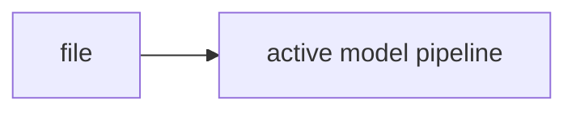

# io.py

## Purpose
Documents `/model/src/v2_model/io.py`. Source: `/model/src/v2_model/io.py`.

## Where it sits in the pipeline
This file supports the active model pipeline and is part of the maintained code path.

## Inputs
- Code-level inputs vary by caller; see the core code snippet below.
 
## Outputs / side effects
- Depends on caller; configuration, path resolution, testing, or derived tables depending on the file.
 
## How the code works
The file is part of the active `version_2/model` implementation and should be read together with the linked notes for the surrounding workflow.

## Core Code
```python
from __future__ import annotations

import json
from datetime import datetime
from pathlib import Path
from typing import Any

import pandas as pd


def timestamped_run_dir(base_output: str | Path) -> Path:
    ts = datetime.utcnow().strftime("%Y%m%dT%H%M%SZ")
    out = Path(base_output) / f"run_{ts}"
    out.mkdir(parents=True, exist_ok=True)
    return out


def ensure_dir(path: str | Path) -> Path:
    p = Path(path)
    p.mkdir(parents=True, exist_ok=True)
    return p


def write_df(df: pd.DataFrame, path: str | Path) -> None:
    p = Path(path)
    p.parent.mkdir(parents=True, exist_ok=True)
    df.to_csv(p, index=False)


def write_json(obj: dict[str, Any], path: str | Path) -> None:
    p = Path(path)
    p.parent.mkdir(parents=True, exist_ok=True)
    p.write_text(json.dumps(obj, indent=2, default=str), encoding="utf-8")
```

## Math / logic
Use the linked notes for the main pipeline math. This file is mostly structural support around the active model workflow.

## Worked Example
Example: this file participates when the notebook calls the CLI or when the pipeline builds/validates rolling windows and output artifacts.

## Visual Flow


## What depends on it
- Other active files in `/model/src/v2_model` and the notebooks.

## Important caveats / assumptions
- This note focuses on the active code only. `model/not_working` is excluded from the maintained manuals.

## Linked Notes
- [Pipeline map](00_version_2_model_pipeline_map.md)
- [Pipeline orchestrator](17_src_v2_model_pipeline.md)

