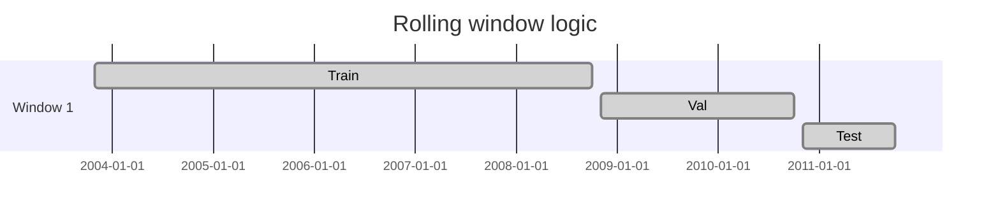

# cv.py

## Purpose
Builds the rolling train/validation/test month windows used by every active model run. Source: `/model/src/v2_model/cv.py`.

## Where it sits in the pipeline
Called by `pipeline.py` and `recommend.py` after the transformed monthly panel is ready.

## Inputs
- sorted unique month-end dates
- `train_months`
- `val_months`
- `test_months`
- `step_months`

## Outputs / side effects
- list of `RollingWindow` objects with train/val/test month lists

## How the code works
The function slides a fixed-length rolling window over the sorted month list. At each step it takes the next `train_months`, then the next `val_months`, then the next `test_months`, then moves forward by `step_months`. It stops when a full test block no longer fits.

## Core Code
```python
from __future__ import annotations

from dataclasses import dataclass


@dataclass
class RollingWindow:
    window_id: int
    train_months: list
    val_months: list
    test_months: list


def build_rolling_windows(months: list, train_months: int, val_months: int, test_months: int, step_months: int) -> list[RollingWindow]:
    months_sorted = sorted(months)
    windows: list[RollingWindow] = []
    i = 0
    wid = 1
    n = len(months_sorted)
    while i + train_months + val_months + test_months <= n:
        windows.append(
            RollingWindow(
                window_id=wid,
                train_months=months_sorted[i : i + train_months],
                val_months=months_sorted[i + train_months : i + train_months + val_months],
                test_months=months_sorted[i + train_months + val_months : i + train_months + val_months + test_months],
            )
        )
        i += step_months
        wid += 1
    return windows
```

## Math / logic
$$W_j = (Train_j, Val_j, Test_j)$$

with lengths fixed by config and start points advancing by `step_months`.

## Worked Example
If you have 270 month-end dates, `train_months = 60`, `val_months = 24`, `test_months = 12`, and `step_months = 12`, then the first window uses months 1-60 for training, 61-84 for validation, and 85-96 for testing. The second window shifts forward by 12 months.

## Visual Flow


## What depends on it
- `/model/src/v2_model/pipeline.py`
- `/model/src/v2_model/recommend.py`

## Important caveats / assumptions
- The window builder assumes the incoming months are already sorted and unique.
- It does not know about missing rows inside a month; that is handled later when train/val/test rows are filtered.

## Linked Notes
- [Pipeline orchestrator](17_src_v2_model_pipeline.md)
- [Recommendation helper](16_src_v2_model_recommend.md)

