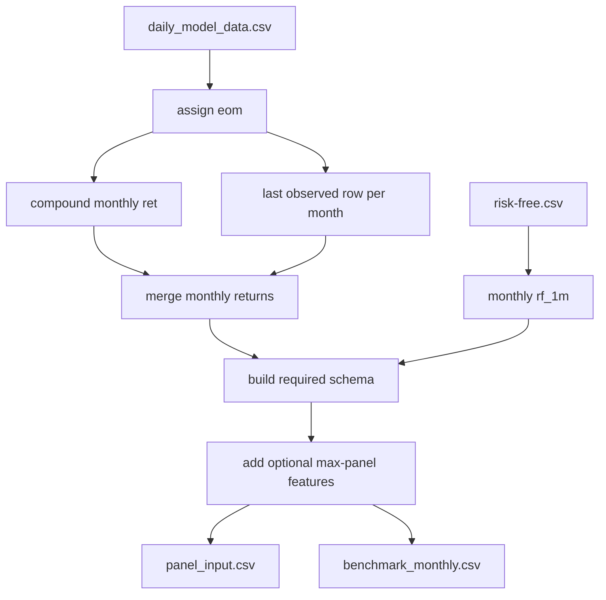

# prepare_inputs.py

## Purpose
Transforms the processed daily panel into the active monthly model panel and monthly benchmark used by the model pipeline. Source: `/model/src/v2_model/prepare_inputs.py`.

## Where it sits in the pipeline
This is the first active model-side transformation step. It consumes `/process/outputs/03_model_data/daily_model_data.csv` and `/data/risk-free.csv`, then writes `/model/data/panel_input.csv`, `/model/data/benchmark_monthly.csv`, and summary files.

## Inputs
- `/process/outputs/03_model_data/daily_model_data.csv`
- `/data/risk-free.csv`
- feature profile registry from `feature_profiles.py`
- config settings from `default.yaml`

## Outputs / side effects
- `/model/data/panel_input.csv`
- `/model/data/benchmark_monthly.csv`
- `/model/data/panel_prep_summary.csv`
- `/model/data/benchmark_prep_summary.csv`
- `/model/data/window_coverage_summary.csv`

## How the code works
The function `build_monthly_inputs(config)` assigns each daily row to an `eom`, compounds daily stock returns into monthly returns, chooses the last observed stock row in each month, merges a monthly risk-free series built from `risk-free.csv`, constructs the required schema (`id`, `eom`, `prc`, `me`, `ret`, `ret_exc`, `ret_exc_lead1m`, `be_me`, `ret_12_1`), then adds the maximum Batch 3 optional feature superset. It also builds a monthly benchmark by compounding daily `VN_Market_Index` returns.

## Core Code
```python
# Safe division helper used by ratio features.
def _safe_div(num: pd.Series, den: pd.Series) -> pd.Series:
    out = num / den.replace({0: np.nan})
    return out.replace([np.inf, -np.inf], np.nan)

# Safe percentage change helper used by growth and TRI features.
def _pct_change_by_id(df: pd.DataFrame, col: str, periods: int) -> pd.Series:
    out = df.groupby('id', sort=False)[col].pct_change(periods)
    return out.replace([np.inf, -np.inf], np.nan)

# Build the active monthly inputs.
def build_monthly_inputs(config: PipelineConfig) -> PreparedArtifacts:
    daily = pd.read_csv(config.paths.input_daily_model_csv)
    daily['Date'] = pd.to_datetime(daily['Date'])
    daily['eom'] = daily['Date'].apply(month_end)

    # Compound daily stock returns to a monthly return.
    ret_monthly = (
        daily.groupby(['Ticker', 'eom'], sort=False)['ret_1d']
        .apply(compound_return)
        .rename('ret')
        .reset_index()
    )

    # Keep the last observed stock row in each month.
    observed = daily.loc[daily.get('is_observed_price', 1).fillna(0).astype(int) == 1].copy()
    month_end_rows = (
        observed.sort_values(['Ticker', 'Date'])
        .groupby(['Ticker', 'eom'], sort=False)
        .tail(1)
        .copy()
    )

    panel = month_end_rows.merge(ret_monthly, on=['Ticker', 'eom'], how='left')
    panel['id'] = panel['Ticker']
    panel['prc'] = panel['Price']
    panel['me'] = panel['Market_Cap']
    panel['be_me'] = _safe_div(panel.get('Equity'), panel['Market_Cap'])
    panel['ret_12_1'] = panel.get('mom12m')
```

## Math / logic
$$ret_{{i,t}} = \prod_{{d \in t}} (1 + ret1d_{{i,d}}) - 1$$

$$ret^{{exc}}_{{i,t}} = ret_{{i,t}} - rf_{{t}}$$

$$ret^{{exc}}_{{i,t+1}} = \text{{lead}}_1(ret^{{exc}}_{{i,t}})$$

$$be\_me_{{i,t}} = \frac{{Equity_{{i,t}}}}{{MarketCap_{{i,t}}}}$$

$$ret\_{{12,1},i,t} = mom12m_{{i,t}}$$

## Worked Example
Real current monthly panel rows:

```csv
id,eom,prc,me,ret,ret_exc,ret_exc_lead1m,be_me,ret_12_1,Bid_Ask,Free_Float_Pct,Shares_Out,age,adv_med,dollar_vol,turn,std_turn,maxret,idiovol,FCF,cfp,dy,ep,gma,lev,cash_ratio,roeq,agr,chcsho,chinv,pchsale_pchinvt,mom1m,mom6m,mom36m,Textile_Cotton_Price,Comm_Brent_Oil,Comm_Copper,Comm_Gold_Spot,Comm_Natural_Gas,Global_Baltic_Dry,USD_CNY_FX,USD_VND_FX,US_Bond_10Y,US_CPI_YoY,US_Dollar_Index,US_FedFunds_Rate,US_GDP_QoQ,US_Market_SP500,US_Volatility_VIX,VN_CPI_YoY,VN_Market_Index,VN_MoneySupply_M2,Hong_Kong_Index,Indonesia_Index,Philippines_Index,Thailand_Index,China_Shanghai_Index,VN_DIAMOND_INDEX,Vol_30D,Vol_90D,tri_ret_12_1,VN_Market_Index_chg1m,VN_Market_Index_chg3m,US_Market_SP500_chg1m,US_Market_SP500_chg3m,Hong_Kong_Index_chg1m,Hong_Kong_Index_chg3m,Indonesia_Index_chg1m,Indonesia_Index_chg3m,Philippines_Index_chg1m,Philippines_Index_chg3m,Thailand_Index_chg1m,Thailand_Index_chg3m,China_Shanghai_Index_chg1m,China_Shanghai_Index_chg3m,VN_DIAMOND_INDEX_chg1m,VN_DIAMOND_INDEX_chg3m,Comm_Brent_Oil_chg1m,Comm_Brent_Oil_chg3m,Comm_Copper_chg1m,Comm_Copper_chg3m,USD_VND_FX_chg1m,USD_VND_FX_chg3m,US_Bond_10Y_chg1m,US_Bond_10Y_chg3m,oc_ret_1m,hl_range_avg_1m,close_loc_avg_1m,intraday_range_vol_1m,tri_mom1m,tri_mom6m,tri_mom36m,debt_assets_raw,cash_assets_raw,receivables_assets,inventory_assets,ppe_assets,cur_assets_assets,cur_liab_assets,sales_assets,sales_equity,ni_assets_raw,ni_sales_raw,opercf_assets_raw,opercf_sales_raw,grossprofit_assets_raw,grossprofit_sales_raw,capex_assets_raw,ebitda_assets_raw,ev_sales_raw,ev_ebitda_raw,debt_equity_raw,assets_growth_12m,equity_growth_12m,cash_growth_12m,debt_growth_12m,receivables_growth_12m,inventory_growth_12m,cur_assets_growth_12m,cur_liab_growth_12m,ppe_growth_12m,sales_growth_12m_raw,net_income_growth_12m_raw,oper_cf_growth_12m_raw,gross_profit_growth_12m_raw,ebitda_growth_12m_raw,capex_growth_12m_raw,mom1m_x_turn,mom6m_x_turn,mom36m_x_turn,mom1m_x_idiovol,mom6m_x_idiovol,mom36m_x_idiovol,cfp_x_lev,ep_x_roeq,be_me_x_roeq,dy_x_lev,ret_12_1_x_vn_mkt_chg1m,ret_12_1_x_us_mkt_chg1m,turn_x_vix_chg1m
AAA VM Equity,2016-11-30,19606.873,1525859.5963,-0.016722397124660504,-0.017081585335612437,-0.20450832430989319,0.5887310130488446,,62.6006,40.251,77.82269,6.333333333333333,,7946822481.884,5208.095479608839,,,,-250604.7911,0.0159146715457203,,0.025345618885105,0.0337144708797748,0.6298283963386292,0.0877664234963747,0.0430512718428886,0.5804107463934189,0.0484847480517072,0.5129438747655717,-0.3671582339997119,,,,72.46,50.47,262.15,1173.2,3.352,1204.0,6.8894,22666.0,2.3809,1.6,101.5,0.5,2.9,2198.81,13.33,4.52,665.07,137.02,22789.77,5148.91,6781.2,1510.24,3250.035,,,,,-0.01587747854394772,-0.01417073062271168,0.03417444676998316,0.012833091503719585,-0.006312313218403309,-0.008143403281907768,-0.05046194201907528,-0.044034234903961855,-0.08421564390665515,-0.12920536715219644,0.009707699302008432,-0.02466999044199325,0.048232022530617646,0.05332830333972782,,,0.04492753623188417,0.07291666666666674,0.18888888888888888,0.2667310944672625,0.015319835154990136,0.016184711947993646,0.30424541221583135,0.5068987341772151,-0.05466234515939583,0.028740921614949372,0.5250001561951375,0.013552271801744564,,,,0.6298283963386292,0.08776642349637473,0.07213179344971166,0.11011239356267445,0.5596363601632345,0.4146807940133226,0.36996499639722097,0.2181000442877334,0.5962091961021208,0.015748640505653985,0.07220833245167634,0.009888669204538639,0.045340060506786455,0.03371447087977481,0.15458259529418633,-0.11193912893729732,0.028136489457229054,4.3680743592163465,33.85913557714388,1.7217304246300043,,,,,,,,,,,,,,,,,,,,,,0.01002351205789703,0.0010911611286489064,0.025345618885105003,,,,-1138.698484111428
AAA VM Equity,2016-12-31,15605.47,1214459.6786,-0.20408165034781367,-0.20450832430989319,-0.06451457246632031,0.7772104628356988,,97.783,40.251,77.82269,6.424603174603175,3518799972.0589995,9113360397.95,7504.0454140045795,,0.0516853584265561,0.0203256669331289,-354357.4202,-0.0879525806267472,,0.034002660465108,0.0320982215077164,0.6897754271787697,0.132140205930365,0.0437496174987753,0.9806603062754916,0.0484847480517072,1.5211285749070238,-1.0930661021720034,-0.1702127636947725,,,70.65,56.82,250.55,1147.5,3.724,961.0,6.945,22761.0,2.4443,1.7,102.21,0.75,2.9,2238.83,14.04,4.52,664.87,158.82,22000.56,5296.711,6840.64,1542.94,3103.637,,32.205,,,-0.0003007202249387664,-0.030420136205212,0.018200754044233047,0.03254207271234666,-0.034630011623636325,-0.055654447003174234,0.028705298791394718,-0.012692541982894379,0.00876541025187283,-0.10342305691027065,0.02165218773175126,0.04027076408600272,-0.04504505336096376,0.0329263824078454,,,0.12581731721814937,0.1581736649001222,-0.044249475491130896,0.13345396969011536,0.004191299744110033,0.020855758880516717,0.026628585828888385,0.5330531861515304,-0.20677967686890264,0.029817468167693987,0.41744358409965815,0.021628086374717886,-0.17492712886955508,,,0.6897754271787697,0.13214020593036507,0.07165505697470144,0.14640919628001542,0.5358781231687788,0.44243546902013625,0.3705091038946522,0.21690000458795708,0.7072162816868501,0.013417807935037804,0.06186172268888371,-0.034707014630564505,-0.1600138953270061,0.0320982215077164,0.1479862647706859,-0.08043321815107134,0.030242602665234205,4.075500993277701,29.229500976658457,2.2490567196392464,,,,,,,,,,,,,,,,-1277.2843088088027,,,-0.0034596879426273207,,,-0.06066752887328974,0.001487603389289204,0.03400266046510794,,,,399.6903408809643
AAA VM Equity,2017-01-31,14605.119,1247533.2527,-0.0641025871056744,-0.06451457246632031,0.1411556611315008,0.7566056991724787,,46.0893,45.5635,85.41753,6.492063492063492,8729301190.689499,28935369660.42,23194.068009224804,,0.0638298103133199,0.0379431563925739,-354357.4202,-0.0856208542488336,,0.0331012099361894,0.0320982215077164,0.6897754271787697,0.132140205930365,0.0437496174987753,0.5744176336605564,0.150808040961436,1.103732797970257,-0.6513719677354486,-0.064102587105675,,,73.88,55.08,271.0,1200.69,3.332,862.0,6.8836,22585.0,2.5116,2.1,100.03,0.75,2.9,2298.37,10.81,4.74,697.28,169.72,23049.12,5293.782,7323.36,1584.29,3149.554,,52.53,,,0.04874637147111471,0.031784551642497716,0.02659424788840603,0.08100087011734813,0.047660605002781686,0.004995958061508876,-0.0005529846729414034,-0.023745320921442437,0.07056649670206294,-0.010998271391529868,0.026799486694232932,0.05921562859358698,0.014794578103044964,0.01582394020045852,,,-0.030623020063358042,0.14037267080745353,0.0816204350429055,0.2290249433106577,-0.007732524932999474,0.011691453144597741,0.027533445158122838,0.3758422350041086,-0.08750000780976175,0.04207500372695734,0.5282057332573826,0.018912893802841443,-0.06410253160965385,,,0.6897754271787697,0.13214020593036507,0.07165505697470144,0.14640919628001542,0.5358781231687788,0.44243546902013625,0.3705091038946522,0.21690000458795708,0.7072162816868501,0.013417807935037804,0.06186172268888371,-0.034707014630564505,-0.1600138953270061,0.0320982215077164,0.1479862647706859,-0.08043321815107134,0.030242602665234205,4.075500993277701,29.229500976658457,2.2490567196392464,,,,,,,,,,,,,,,,-1486.799764896283,,,-0.002432254487719218,,,-0.059059161314900376,0.0014481652734549468,0.033101209936189396,,,,-5335.9572414384675
```

The first row shows a stock-month record after daily-to-monthly aggregation: `AAA VM Equity` at `2016-11-30` keeps month-end price and market cap, monthly compounded return `ret`, excess return `ret_exc`, next-month target `ret_exc_lead1m`, and structural predictors such as `be_me` and `ret_12_1`.

## Visual Flow


## What depends on it
- `/model/src/v2_model/preprocess.py`
- `/model/src/v2_model/pipeline.py`
- `/model/notebooks/00_run_and_review_model.ipynb`
- `/model/notebooks/01_run_and_review_nn_architectures.ipynb`

## Important caveats / assumptions
- The max monthly panel is built once and then narrowed by feature profile at model time.
- Growth and TRI features rely on safe `% change` handling to avoid non-finite values.
- The benchmark series is based on `VN_Market_Index`, not the top-30 market-cap portfolios.

## Linked Notes
- [Pipeline map](00_version_2_model_pipeline_map.md)
- [Feature profiles](34_src_v2_model_feature_profiles.md)
- [Preprocess step](12_src_v2_model_preprocess.md)
- [Benchmark logic](13_src_v2_model_benchmark.md)

