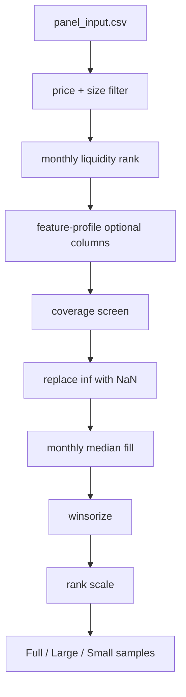

# preprocess.py

## Purpose
Applies model-side monthly filtering, feature-profile selection, coverage checks, filling, winsorization, rank scaling, and sample construction. Source: `/model/src/v2_model/preprocess.py`.

## Where it sits in the pipeline
This file sits between the monthly panel from `prepare_inputs.py` and the rolling model execution in `pipeline.py`. It decides which rows and features actually reach the models.

## Inputs
- `/model/data/panel_input.csv`
- `/model/data/benchmark_monthly.csv`
- config preprocessing rules
- feature profile registry

## Outputs / side effects
- in-memory `PreparedData` and `PreparedScoringData` objects
- a preprocess report and feature list written by `pipeline.py` based on these objects

## How the code works
The file loads the monthly panel, filters by `prc` and `me`, ranks monthly liquidity using `adv_med`, keeps rows in the configured liquidity bucket, requests optional columns from the active feature profile, drops low-coverage optionals using labeled rows, replaces non-finite numerics with `NaN`, fills numeric columns by month median, applies a panel-wide backstop fill to the selected model features, drops rows missing the required schema, constructs `ret_lead1m` and `me2`, then winsorizes and rank-scales the feature columns. Finally it creates `Full`, `Large`, and `Small` samples and a latest fully labeled scoring slice.

## Core Code
```python
# Winsorize selected numeric columns by month.
def _winsorize_by_month(df: pd.DataFrame, cols: list[str], date_col: str, lower: float, upper: float) -> pd.DataFrame:
    out = df.copy()
    for c in cols:
        out[c] = out[c].replace([np.inf, -np.inf], np.nan)
        s = out[c]
        if s.dropna().nunique() <= 1:
            continue
        ql = out.groupby(date_col, sort=False)[c].transform(lambda x: x.quantile(lower))
        qu = out.groupby(date_col, sort=False)[c].transform(lambda x: x.quantile(upper))
        out[c] = out[c].clip(lower=ql, upper=qu)
    return out

# Rank-scale features into roughly [-1, 1] by month.
def _rank_scale_minus1_to_1(df: pd.DataFrame, cols: list[str], date_col: str) -> pd.DataFrame:
    out = df.copy()
    for c in cols:
        out[c] = out.groupby(date_col, sort=False)[c].rank(pct=True)
        out[c] = 2.0 * out[c] - 1.0
    return out

# Core transformed panel preparation.
def _prepare_transformed_panel(config: PipelineConfig):
    panel, benchmark = _load_inputs(config)
    panel = panel.loc[(panel['prc'] >= config.preprocess.min_price) & (panel['me'] >= config.preprocess.min_me)].copy()
    keep_share = LIQUIDITY_KEEP_SHARE[config.preprocess.liquidity_category]
    panel['liq_rank_pct'] = panel.groupby('eom', sort=False)['adv_med'].rank(pct=True)
    panel['is_liquid'] = panel['liq_rank_pct'] >= (1.0 - keep_share)
    panel = panel.loc[panel['is_liquid']].copy()
```

## Math / logic
$$\text{{liq\_rank\_pct}}_{{i,t}} = \text{{percentile rank of }} adv\_med_{{i,t}} \text{{ within month }} t$$

$$\text{{is\_liquid}}_{{i,t}} = 1\{\text{{liq\_rank\_pct}}_{{i,t}} \ge 1 - s\}$$

where $s$ is the keep share from the liquidity category.

$$ x^{{win}}_{{i,t}} = \min(\max(x_{{i,t}}, q_{{0.01},t}}), q_{{0.99},t}) $$

$$x^{{rank}}_{{i,t}} = 2 \cdot rankpct(x^{{win}}_{{i,t}}) - 1$$

## Worked Example
Suppose a month has three stocks with `adv_med` values `10`, `50`, `90`. Their percentile ranks are approximately `0.33`, `0.67`, and `1.00`. Under a 50% keep-share rule, the second and third stocks survive; under a 30% rule only the third survives. This is the core logic that turns a broad monthly panel into the actual model sample.

## Visual Flow


## What depends on it
- `/model/src/v2_model/pipeline.py`
- `/model/src/v2_model/recommend.py` via `prepare_scoring_data(...)`
- all model implementations indirectly

## Important caveats / assumptions
- The active default config uses `broad_liquid_top50`, not the earlier top-70 plan.
- `Large` and `Small` are built from the transformed `Full` sample, not from separate raw universes.
- The active recommendation path scores the latest fully labeled month only.

## Linked Notes
- [Pipeline map](00_version_2_model_pipeline_map.md)
- [Feature profiles](34_src_v2_model_feature_profiles.md)
- [Prepare inputs](11_src_v2_model_prepare_inputs.md)
- [Pipeline orchestration](17_src_v2_model_pipeline.md)
- [Recommendation helper](16_src_v2_model_recommend.md)

