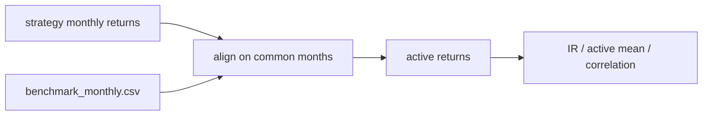

# benchmark.py

## Purpose
Compares model strategy returns to the monthly benchmark and computes active-return metrics such as information ratio. Source: `/model/src/v2_model/benchmark.py`.

## Where it sits in the pipeline
Called by `pipeline.py` after portfolio returns are built for a model run.

## Inputs
- strategy monthly return series
- benchmark monthly return series
- configured cost level labels

## Outputs / side effects
- benchmark comparison tables under `/outputs/run_*/benchmark/`

## How the code works
The main function aligns strategy and benchmark returns on the overlapping month set, computes active return as strategy minus benchmark, then reports mean active return, information ratio, and return correlation. The label on the strategy reflects the configured transaction-cost level.

## Core Code
```python
from __future__ import annotations

import numpy as np
import pandas as pd


def build_benchmark_monthly(benchmark_monthly: pd.DataFrame, rf_monthly: pd.DataFrame) -> pd.DataFrame:
    out = benchmark_monthly.copy()
    out["eom"] = pd.to_datetime(out["eom"]).dt.to_period("M").dt.to_timestamp("M")
    out = out.merge(rf_monthly[["eom", "rf_1m"]], on="eom", how="left")
    out["benchmark_exc"] = out["benchmark_ret"] - out["rf_1m"]
    return out.sort_values("eom").reset_index(drop=True)


def compare_vs_benchmark(ls_cost_df: pd.DataFrame, benchmark_df: pd.DataFrame, *, model_name: str, cost_bps: int) -> pd.DataFrame:
    ls = ls_cost_df.copy()
    ls["eom"] = pd.to_datetime(ls["eom"]).dt.to_period("M").dt.to_timestamp("M")
    rows = []
    for label, strat_col in [("equal", f"net_excess_ew_{cost_bps}bps"), ("value", f"net_excess_vw_{cost_bps}bps")]:
        aligned = ls[["eom", strat_col]].merge(benchmark_df[["eom", "benchmark_exc"]], on="eom", how="inner")
        active = aligned[strat_col] - aligned["benchmark_exc"]
        ir = float(active.mean() / active.std(ddof=1)) if len(active) > 1 and active.std(ddof=1) > 0 else np.nan
        rows.append({
            "weighting": label,
            "strategy": f"{model_name}_LS_{'EW' if label == 'equal' else 'VW'}_net_{cost_bps}bps",
            "benchmark": f"benchmark_{label}_excess",
            "n_months": int(len(aligned)),
            "mean_active_return": float(active.mean()) if len(active) else np.nan,
            "information_ratio": ir,
            "corr_strategy_benchmark": float(aligned[strat_col].corr(aligned['benchmark_exc'])) if len(aligned) else np.nan,
        })
    return pd.DataFrame(rows)
```

## Math / logic
$$AR_t = R^{{strat}}_t - R^{{bench}}_t$$

$$IR = \frac{\overline{{AR}}}{\sigma(AR)}$$

## Worked Example
If a strategy earns `2%` in one month and the benchmark earns `1%`, the active return is `1%`. The information ratio scales the mean of that active-return series by its volatility over all overlapping months.

## Visual Flow


## What depends on it
- `/model/src/v2_model/pipeline.py`
- report notebooks and downstream comparisons

## Important caveats / assumptions
- Only overlapping months are compared.
- Benchmark Sharpe and IR interpretation should always note the benchmark construction and overlap window.

## Linked Notes
- [Portfolio logic](14_src_v2_model_portfolio.md)
- [Comparison outputs](15_src_v2_model_compare.md)
- [Pipeline orchestrator](17_src_v2_model_pipeline.md)

