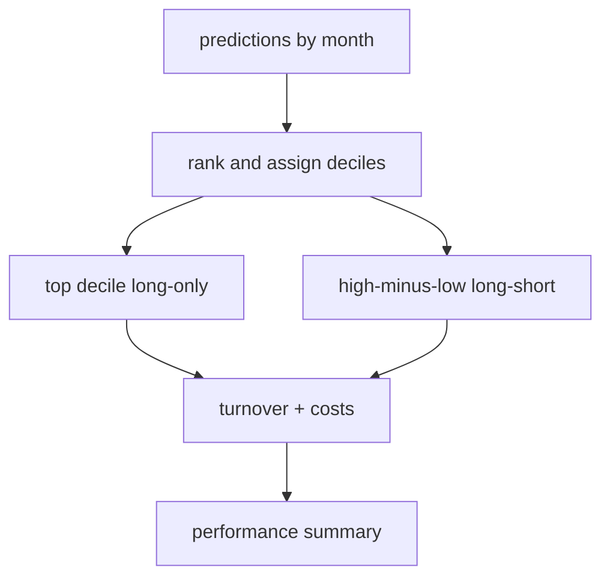

# portfolio.py

## Purpose
Turns prediction tables into decile portfolios, turnover estimates, transaction-cost-adjusted returns, and performance summaries. Source: `/model/src/v2_model/portfolio.py`.

## Where it sits in the pipeline
Called by `pipeline.py` after each model has produced out-of-sample prediction tables.

## Inputs
- prediction table with `eom`, `id`, `me2`, `ret_lead1m`, `yhat`
- portfolio config including transaction-cost grid

## Outputs / side effects
- decile tables
- monthly portfolio return series
- performance summary tables under `/outputs/run_*/portfolio/`

## How the code works
The file ranks predictions within each month, assigns deciles when there are enough unique scores, constructs equal-weight and value-weight decile returns, then defines long-only top-decile and long-short high-minus-low strategies. It also computes turnover from month-to-month changes in portfolio constituents/weights and subtracts transaction costs at configured basis-point levels.

## Core Code
```python
from __future__ import annotations

import numpy as np
import pandas as pd


def assign_deciles(s: pd.Series, n_deciles: int) -> pd.Series:
    if s.notna().sum() < n_deciles or s.nunique(dropna=True) < n_deciles:
        return pd.Series(np.nan, index=s.index)
    ranks = s.rank(method="first")
    return pd.qcut(ranks, q=n_deciles, labels=False, duplicates="drop")


def build_decile_monthly(pred_full: pd.DataFrame, n_deciles: int) -> tuple[pd.DataFrame, pd.DataFrame]:
    port = pred_full.dropna(subset=["eom", "id", "yhat", "y_true", "me2", "ret_lead1m"]).copy()
    port["DecileRank"] = port.groupby("eom", sort=False)["yhat"].apply(lambda s: assign_deciles(s, n_deciles)).reset_index(level=0, drop=True)
    port = port.dropna(subset=["DecileRank"]).copy()
    port["DecileRank"] = port["DecileRank"].astype(int)
    port["eq_weights"] = 1.0 / port.groupby(["eom", "DecileRank"], sort=False)["id"].transform("size")
    port["me_weights"] = port["me2"] / port.groupby(["eom", "DecileRank"], sort=False)["me2"].transform("sum")
    port["excess_return_stock_ew"] = port["y_true"] * port["eq_weights"]
    port["excess_return_stock_vw"] = port["y_true"] * port["me_weights"]
    port["return_stock_ew"] = port["ret_lead1m"] * port["eq_weights"]
    port["return_stock_vw"] = port["ret_lead1m"] * port["me_weights"]
    port["pred_excess_stock_ew"] = port["yhat"] * port["eq_weights"]
    port["pred_excess_stock_vw"] = port["yhat"] * port["me_weights"]
    decile_monthly = (
        port.groupby(["eom", "DecileRank"], as_index=False)
        .agg(
            excess_return_portfolio_ew=("excess_return_stock_ew", "sum"),
            excess_return_portfolio_vw=("excess_return_stock_vw", "sum"),
            return_portfolio_ew=("return_stock_ew", "sum"),
            return_portfolio_vw=("return_stock_vw", "sum"),
            pred_excess_return_portfolio_ew=("pred_excess_stock_ew", "sum"),
            pred_excess_return_portfolio_vw=("pred_excess_stock_vw", "sum"),
            n_stocks=("id", "nunique"),
        )
        .sort_values(["eom", "DecileRank"]).reset_index(drop=True)
    )
    return port, decile_monthly


def build_decile_table(decile_monthly: pd.DataFrame, weighting: str) -> pd.DataFrame:
    pred_col = "pred_excess_return_portfolio_ew" if weighting == "ew" else "pred_excess_return_portfolio_vw"
    real_col = "excess_return_portfolio_ew" if weighting == "ew" else "excess_return_portfolio_vw"
    raw_col = "return_portfolio_ew" if weighting == "ew" else "return_portfolio_vw"
    rows = []
    for d in sorted(decile_monthly["DecileRank"].unique()):
        g = decile_monthly[decile_monthly["DecileRank"] == d]
        rows.append({
            "rank": int(d),
            "Pred": float(g[pred_col].mean()),
            "Real": float(g[real_col].mean()),
            "Std": float(g[real_col].std(ddof=1)) if len(g) > 1 else np.nan,
            "Sharpe": float((g[real_col].mean() / g[raw_col].std(ddof=1)) * np.sqrt(12)) if len(g) > 1 and g[raw_col].std(ddof=1) > 0 else np.nan,
        })
    top = decile_monthly[decile_monthly["DecileRank"] == decile_monthly["DecileRank"].max()].set_index("eom")
    bot = decile_monthly[decile_monthly["DecileRank"] == decile_monthly["DecileRank"].min()].set_index("eom")
    common = top.index.intersection(bot.index)
    if len(common):
        hml_pred = top.loc[common, pred_col] - bot.loc[common, pred_col]
        hml_real = top.loc[common, real_col] - bot.loc[common, real_col]
        hml_raw = top.loc[common, raw_col] - bot.loc[common, raw_col]
        rows.append({
            "rank": "H-L",
            "Pred": float(hml_pred.mean()),
            "Real": float(hml_real.mean()),
            "Std": float(hml_real.std(ddof=1)) if len(hml_real) > 1 else np.nan,
            "Sharpe": float((hml_real.mean() / hml_raw.std(ddof=1)) * np.sqrt(12)) if len(hml_real) > 1 and hml_raw.std(ddof=1) > 0 else np.nan,
        })
    tab = pd.DataFrame(rows)
    min_rank = int(decile_monthly["DecileRank"].min())
    max_r
```

## Math / logic
$$R^{{EW}}_{{d,t}} = \frac{1}{N_{{d,t}}} \sum_{{i \in d,t}} ret_{{i,t+1}}$$

$$R^{{LS}}_t = R_{{high,t}} - R_{{low,t}}$$

$$R^{{net}}_t = R^{{gross}}_t - turnover_t \cdot cost$$

$$Sharpe_{{ann}} = \frac{\overline r}{\sigma(r)} \sqrt{12}$$

## Worked Example
If the top decile has next-month returns `[4%, 2%, 1%]`, the equal-weight long-only return is `(0.04 + 0.02 + 0.01)/3 = 2.33%`. If the bottom decile return is `-1.5%`, the long-short return is `2.33% - (-1.5%) = 3.83%`.

## Visual Flow


## What depends on it
- `/model/src/v2_model/pipeline.py`
- `/model/src/v2_model/benchmark.py`
- `/model/src/v2_model/compare.py`

## Important caveats / assumptions
- Months with too few unique predictions are dropped from decile construction. This matters especially for tree models.
- Long-short cumulative returns are only directly comparable when `n_periods` is comparable.

## Linked Notes
- [Benchmark comparison](13_src_v2_model_benchmark.md)
- [Comparison outputs](15_src_v2_model_compare.md)
- [Pipeline orchestrator](17_src_v2_model_pipeline.md)

