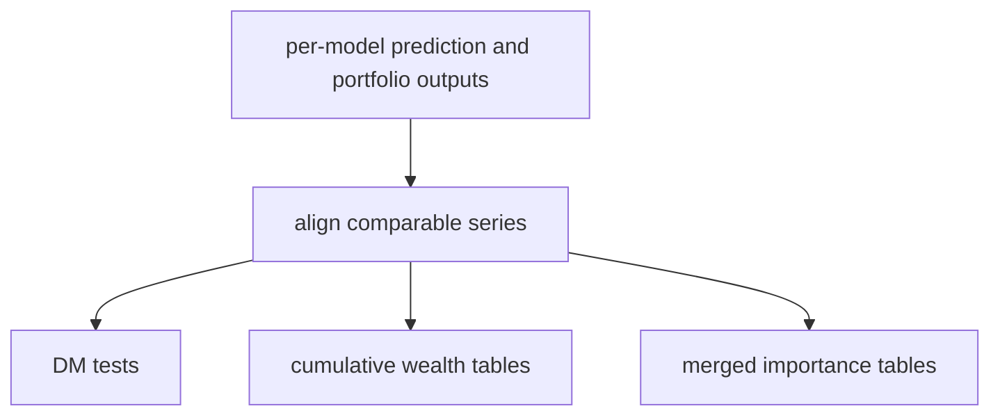

# compare.py

## Purpose
Builds cross-model comparison tables, cumulative-return tables, merged feature-importance outputs, and Diebold–Mariano statistics. Source: `/model/src/v2_model/compare.py`.

## Where it sits in the pipeline
Called near the end of `pipeline.py` after per-model outputs have already been written.

## Inputs
- per-model run artifacts: predictions, portfolio summaries, benchmark summaries, importance files
- benchmark and performance series aligned by model

## Outputs / side effects
- `compare/` CSVs in the run directory, including DM-test tables, cumulative series, and merged importance summaries

## How the code works
The file collects model-level outputs, aligns comparable series, runs pairwise or reference-model Diebold–Mariano tests on forecast losses, and writes merged comparison tables. It also builds cumulative wealth tables from the actual monthly strategy return series.

## Core Code
```python
from __future__ import annotations

import collections
import warnings

import numpy as np
import pandas as pd
import statsmodels.api as sm
from scipy.stats import t
from sklearn.utils.validation import check_array


def dm_test(e1, e2, alternative: str = "two_sided", h: int = 1, power: int = 2):
    alternatives = ["two_sided", "less", "greater"]
    if alternative not in alternatives:
        raise ValueError(f"alternative must be one of {alternatives}")
    e1 = check_array(e1, ensure_2d=False)
    e2 = check_array(e2, ensure_2d=False)
    d = np.abs(e1) ** power - np.abs(e2) ** power
    n = d.shape[0]
    d_cov = sm.tsa.acovf(d, fft=True, nlag=h - 1)
    d_var = (d_cov[0] + 2 * d_cov[1:].sum()) / n
    if d_var > 0:
        dm_stat = np.mean(d) / np.sqrt(d_var)
    elif h == 1:
        raise ValueError("Variance of DM statistic is zero")
    else:
        warnings.warn("Variance is negative, using horizon h=1", RuntimeWarning)
        return dm_test(e1, e2, alternative=alternative, h=1, power=power)
    k = ((n + 1 - 2 * h + h / n * (h - 1)) / n) ** 0.5
    dm_stat *= k
    if alternative == "two_sided":
        p_value = 2 * t.cdf(-abs(dm_stat), df=n - 1)
    else:
        p_value = t.cdf(dm_stat, df=n - 1)
        if alternative == "greater":
            p_value = 1 - p_value
    out = collections.namedtuple("dm_test_result", ["dm_stat", "p_value"])
    return out(dm_stat=dm_stat, p_value=p_value)


def build_dm_table(predictions_by_model: dict[str, pd.DataFrame]) -> pd.DataFrame:
    model_names = list(predictions_by_model.keys())
    merged = None
    for m in model_names:
        p = predictions_by_model[m][["eom", "id", "yhat", "y_true"]].copy().rename(columns={"yhat": m, "y_true": "y_true_ref"})
        merged = p if merged is None else merged.merge(p[["eom", "id", m]], on=["eom", "id"], how="inner")
    if merged is None or len(merged) == 0:
        return pd.DataFrame(index=model_names, columns=model_names)
    y_true = merged["y_true_ref"].to_numpy(dtype=float)
    dm_table = pd.DataFrame(index=model_names, columns=model_names, dtype=object)
    for i, m1 in enumerate(model_names):
        for j, m2 in enumerate(model_names):
            if i == j:
                dm_table.loc[m1, m2] = 0.0
                continue
            e1 = y_true - merged[m1].to_numpy(dtype=float)
            e2 = y_true - merged[m2].to_numpy(dtype=float)
            if np.allclose(e1, e2):
                dm_table.loc[m1, m2] = 0.0
                continue
            try:
                stat, pval = dm_test(e1, e2, alternative="two_sided", h=1, power=2)
                tag = ""
                if pval <= 0.10:
                    tag = "*"
                if pval <= 0.05:
                    tag = "**"
                if pval <= 0.01:
                    tag = "***"
                dm_table.loc[m1, m2] = f"{float(stat):.6f}{tag}"
            except Exception:
                dm_table.loc[m1, m2] = np.nan
    return dm_table.reset_index().rename(columns={"index": "model"})


def merge_variable_importance(importance_by_model: dict[str, pd.DataFrame]) -> tuple[pd.DataFrame, pd.DataFrame]:
    merged = None
    for model_name, df_imp in importance_by_model.items():
        if df_imp is None or len(df_imp) == 0:
            continue
        d = df_imp[["Feature", "var_imp"]].copy().rename(columns={"var_imp": model_name})
        merged = d if merged is None else merged.merge(d, on="Feature", how="outer")
    if merged is None:
        return pd.DataFrame(), pd.DataFrame()
    merged = merged.sort_values("Feature").reset_index(drop=True)
    rank_df = merged.copy()
    for c in rank_df.columns:
        if c == "Feature":
            continue
        rank_df[c + "_rank"] = rank_df[c].rank(ascending=False, method="min")
    return merged, rank_df


def build_cumulative_tables(top_bottom_by_model: dict[str, pd.DataFrame], benchmark_monthly: pd.DataFrame) -> tuple[pd.DataFrame, pd.DataFrame]:
    bench = benchmark_monthly[["eom", "benchmark_re
```

## Math / logic
$$d_t = L(e^A_t) - L(e^B_t)$$

$$DM = \frac{\bar d}{\sqrt{\widehat{{Var}}(\bar d)}}$$

The comparison layer also builds cumulative wealth from monthly returns:
$$W_t = \prod_{s \le t} (1 + r_s)$$

## Worked Example
If model A has monthly squared forecast errors `[1, 4, 1]` and model B has `[2, 2, 2]`, then the DM loss-difference series is `[-1, 2, -1]`. The DM statistic tests whether the mean of that difference is statistically different from zero.

## Visual Flow


## What depends on it
- `/model/src/v2_model/pipeline.py`
- downstream reporting notes and review notebooks

## Important caveats / assumptions
- Comparison quality depends on comparable coverage lengths.
- Tree-model cumulative returns can look low simply because many months are dropped before portfolio construction.

## Linked Notes
- [Benchmark comparison](13_src_v2_model_benchmark.md)
- [Portfolio logic](14_src_v2_model_portfolio.md)
- [Pipeline orchestrator](17_src_v2_model_pipeline.md)

