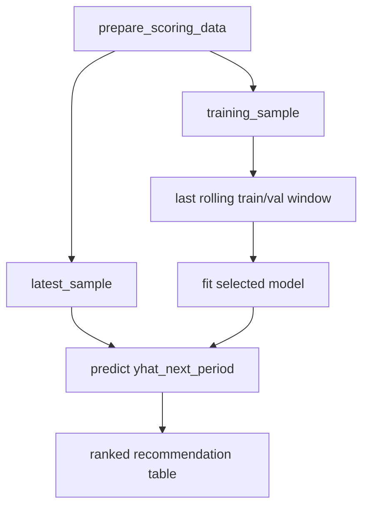

# recommend.py

## Purpose
Produces the active recommendation table for the latest fully labeled month in the transformed monthly panel. Source: `/model/src/v2_model/recommend.py`.

## Where it sits in the pipeline
This file is outside the main training loop. It reuses the active preprocessing and model registry to fit the requested model on the most recent rolling train/validation window, then scores the latest fully labeled month.

## Inputs
- `PipelineConfig`
- model name such as `OLS`, `ENET`, or `NN`
- transformed scoring data from `prepare_scoring_data(...)`
- rolling windows from `cv.py`

## Outputs / side effects
Returns a `RecommendationResult` containing the scored month, calibration ranges, and a ranked recommendation table. The notebooks typically save this table into the active run directory.

## How the code works
The function `build_latest_recommendations(...)` first calls `prepare_scoring_data(config)`, which returns a transformed monthly panel and the latest fully labeled scoring slice. It then rebuilds the rolling windows on the training sample, takes the last train and validation blocks, chooses the feature set for the requested model, fits the model function, predicts `yhat_next_period` for the latest fully labeled month, merges back readable raw fields, and sorts descending by the prediction.

## Core Code
```python
def build_latest_recommendations(config: PipelineConfig, model_name: str, top_k: int = 10) -> RecommendationResult:
    prepared = prepare_scoring_data(config)
    months = sorted(prepared.training_sample['eom'].dropna().unique())
    windows = build_rolling_windows(months, config.cv.train_months, config.cv.val_months, config.cv.test_months, config.cv.step_months)
    last_window = windows[-1]

    tr = prepared.training_sample.loc[prepared.training_sample['eom'].isin(last_window.train_months)].copy()
    va = prepared.training_sample.loc[prepared.training_sample['eom'].isin(last_window.val_months)].copy()
    latest = prepared.latest_sample.copy()

    feature_cols = _feature_set_for_model(model_name, prepared.feature_cols)
    model_fn = _model_callable(model_name)
    fit = model_fn(
        tr[feature_cols].to_numpy(float),
        tr['ret_exc_lead1m'].to_numpy(float),
        va[feature_cols].to_numpy(float),
        va['ret_exc_lead1m'].to_numpy(float),
        latest[feature_cols].to_numpy(float),
        **_model_kwargs(config, model_name),
    )
```

## Math / logic
$$\hat y^{{next}}_{{i,t}} = f_\theta(X_{{i,t}})$$

where $t$ is the latest fully labeled month that survives preprocessing. The recommendation table ranks stocks by $\hat y^{{next}}_{{i,t}}$ from high to low.

## Worked Example
If the latest fully labeled month in the transformed panel is `2026-02-28`, the function uses the last rolling train/validation window before that date, fits the requested model, and returns the top `k` stocks ranked by predicted next-month excess return. This is the active notebook recommendation path.

## Visual Flow


## What depends on it
- `/model/notebooks/00_run_and_review_model.ipynb`
- `/model/notebooks/01_run_and_review_nn_architectures.ipynb`

## Important caveats / assumptions
- This is the latest fully labeled recommendation path, not the archived true-latest path.
- The latest scoring month can be earlier than the maximum `eom` in `panel_input.csv` because the future target must be known.

## Linked Notes
- [Preprocess step](12_src_v2_model_preprocess.md)
- [Rolling windows](10_src_v2_model_cv.md)
- [Pipeline](17_src_v2_model_pipeline.md)
- [Main notebook](05_notebooks_00_run_and_review_model.md)
- [NN notebook](37_notebooks_01_run_and_review_nn_architectures.md)

