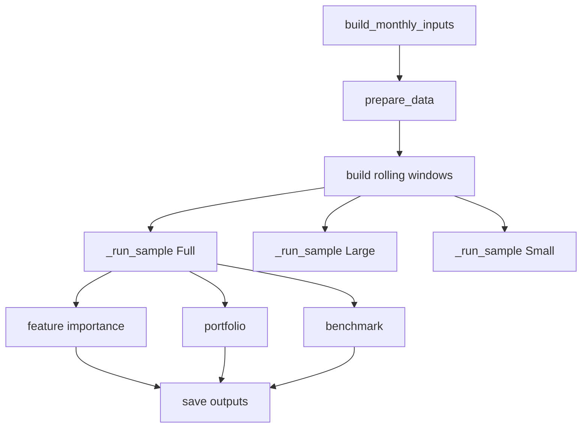

# pipeline.py

## Purpose
Orchestrates the active model pipeline: monthly panel preparation, preprocessing, rolling-window model fits, feature importance, portfolio construction, benchmark comparison, and cross-model comparison outputs. Source: `/model/src/v2_model/pipeline.py`.

## Where it sits in the pipeline
This is the central execution layer behind `run_model.py`. It is the file that turns the prepared monthly panel into model outputs under `/model/outputs/run_...`.

## Inputs
- `PipelineConfig`
- monthly panel and benchmark from `prepare_inputs.py`
- transformed samples from `preprocess.py`
- model functions from `/model/src/v2_model/models/*`

## Outputs / side effects
- per-run output folder under `/model/outputs/run_...`
- preprocess artifacts
- prediction CSVs
- complexity tables
- feature-importance tables
- portfolio and benchmark summaries
- comparison tables and manifests

## How the code works
The orchestrator first ensures the monthly panel exists by calling `build_monthly_inputs(config)` if needed, then loads transformed samples via `prepare_data(config)`. It builds rolling windows from the transformed `Full` sample, iterates through the selected models, and for each model runs `Full`, `Large`, and `Small` samples. The helper `_run_sample(...)` handles train/validation/test slicing inside each window, model fitting, and prediction collection. After sample runs finish, the pipeline computes feature importance on the last window, builds decile portfolios, compares strategies to the benchmark, and finally writes cross-model comparison tables and a manifest.

## Core Code
```python
def _feature_set_for_model(model_name: str, feature_cols: list[str]) -> list[str]:
    if model_name.upper() == 'OLS3':
        return ['me', 'be_me', 'ret_12_1']
    return list(feature_cols)

# Run one sample (Full / Large / Small) through all rolling windows.
def _run_sample(model_name: str, sample_name: str, df: pd.DataFrame, windows, feature_cols, model_fn, model_kwargs):
    rows = []
    metric_rows = []
    complexity_rows = []
    for idx, w in enumerate(windows, start=1):
        tr = df.loc[df['eom'].isin(w.train_months)].copy()
        va = df.loc[df['eom'].isin(w.val_months)].copy()
        te = df.loc[df['eom'].isin(w.test_months)].copy()
        keep = feature_cols + ['ret_exc_lead1m', 'ret_lead1m', 'me2']
        tr = tr.dropna(subset=keep)
        va = va.dropna(subset=keep)
        te = te.dropna(subset=keep)
        fit = model_fn(
            tr[feature_cols].to_numpy(float),
            tr['ret_exc_lead1m'].to_numpy(float),
            va[feature_cols].to_numpy(float),
            va['ret_exc_lead1m'].to_numpy(float),
            te[feature_cols].to_numpy(float),
            **model_kwargs,
        )
```

## Math / logic
$$\text{{For each window }} w:\quad \hat y^{{(w)}} = f_\theta(X_{{train,w}}, X_{{val,w}}, X_{{test,w}})$$

$$R^2_{{OOS,w}} = 1 - \frac{\sum_{{i \in test_w}} (y_i - \hat y_i)^2}{\sum_{{i \in test_w}} y_i^2}$$

Feature importance is based on the last window only:
$$\Delta R^2_f = R^2_{{base}} - R^2_{{f=0}}$$

## Worked Example
Suppose the `Full` sample has 15 rolling windows. For `ENET`, the pipeline will fit 15 train/validation/test windows, collect out-of-sample predictions for each window, then merge those into one prediction table, one R² summary, one complexity table, one feature-importance table, and one portfolio report.

## Visual Flow


## What depends on it
- `/model/run_model.py`
- both active notebooks
- all model implementations
- downstream report generation

## Important caveats / assumptions
- The active recommendation workflow is separate from the training loop and uses `recommend.py`.
- OLS3 forces a fixed 3-feature set regardless of the active profile.
- Feature importance is computed on the last window only, not averaged across all windows.

## Linked Notes
- [Pipeline map](00_version_2_model_pipeline_map.md)
- [Prepare inputs](11_src_v2_model_prepare_inputs.md)
- [Preprocess step](12_src_v2_model_preprocess.md)
- [Portfolio construction](14_src_v2_model_portfolio.md)
- [Model comparison outputs](15_src_v2_model_compare.md)

