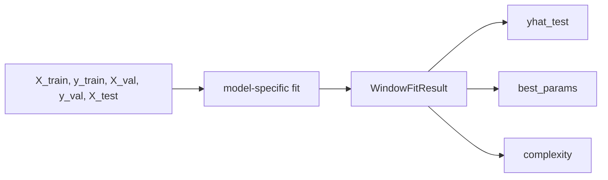

# base.py

## Purpose
Utility functions and shared return container for window-level model fits. Source: `/model/src/v2_model/models/base.py`.

## Where it sits in the pipeline
Called by `/model/src/v2_model/pipeline.py` inside each rolling train/validation/test window. The file returns a standardized `WindowFitResult` so the rest of the pipeline can treat different model families uniformly.

## Inputs
- `X_train`, `y_train`
- `X_val`, `y_val`
- `X_test`
- model-specific hyperparameters from config

## Outputs / side effects
- returns a `WindowFitResult`
- no direct file writes; output persistence is handled by `pipeline.py`

## How the code works
WindowFitResult, rmse, r2_oos_zero, huber_loss_error

## Core Code
```python
from __future__ import annotations

from dataclasses import dataclass
from typing import Any

import numpy as np


@dataclass
class WindowFitResult:
    y_pred: np.ndarray
    best_params: dict[str, Any]
    best_score: float
    complexity: dict[str, Any]
    fitted_model: Any


def rmse(y_true: np.ndarray, y_pred: np.ndarray) -> float:
    y_true = np.asarray(y_true, dtype=float)
    y_pred = np.asarray(y_pred, dtype=float)
    return float(np.sqrt(np.mean((y_true - y_pred) ** 2)))


def r2_oos_zero(y_true: np.ndarray, y_pred: np.ndarray) -> float:
    y_true = np.asarray(y_true, dtype=float)
    y_pred = np.asarray(y_pred, dtype=float)
    den = float(np.sum(y_true**2))
    if den <= 0:
        return np.nan
    return float(1.0 - np.sum((y_true - y_pred) ** 2) / den)


def huber_loss_error(y_true: np.ndarray, y_pred: np.ndarray, delta: float = 1.35) -> float:
    y_true = np.asarray(y_true, dtype=float)
    y_pred = np.asarray(y_pred, dtype=float)
    err = y_true - y_pred
    abs_err = np.abs(err)
    quad = abs_err <= delta
    loss = np.where(quad, 0.5 * (err**2), delta * (abs_err - 0.5 * delta))
    return float(np.sum(loss))
```

## Math / logic
$$RMSE = \sqrt{\frac{1}{n}\sum_i (y_i-\hat y_i)^2}$$

$$R^2_{OOS} = 1 - \frac{\sum_i (y_i-\hat y_i)^2}{\sum_i y_i^2}$$

$$Huber_\delta(e)=\begin{cases}\frac12 e^2,& |e|\le \delta\\ \delta(|e|-\frac12\delta),& |e|>\delta\end{cases}$$

## Worked Example
If actual returns are `[0.02, -0.01]` and predictions are `[0.01, -0.02]`, then the squared errors are `0.0001` and `0.0001`, so `RMSE = 0.01`. The shared helpers apply that same logic to every window.

## Visual Flow


## What depends on it
- `/model/src/v2_model/pipeline.py`
- summary and portfolio construction downstream through the shared `WindowFitResult`

## Important caveats / assumptions
These helpers do not know anything about financial meaning. They just standardize metric computation across model families.

## Linked Notes
- [Pipeline orchestrator](17_src_v2_model_pipeline.md)
- [Base model utilities](19_src_v2_model_models_base.md)
- [Main notebook](05_notebooks_00_run_and_review_model.md)

