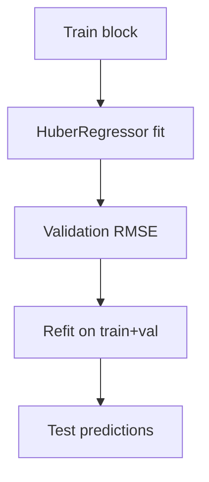

# ols_huber.py

## Purpose
Robust linear baseline using HuberRegressor on the active feature set. Source: `/model/src/v2_model/models/ols_huber.py`.

## Where it sits in the pipeline
Called by `/model/src/v2_model/pipeline.py` inside each rolling train/validation/test window. The file returns a standardized `WindowFitResult` so the rest of the pipeline can treat different model families uniformly.

## Inputs
- `X_train`, `y_train`
- `X_val`, `y_val`
- `X_test`
- model-specific hyperparameters from config

## Outputs / side effects
- returns a `WindowFitResult`
- no direct file writes; output persistence is handled by `pipeline.py`

## How the code works
HuberRegressor validation/refit path

## Core Code
```python
from __future__ import annotations

import numpy as np
from sklearn.linear_model import HuberRegressor

from .base import WindowFitResult, rmse


def run_window(
    X_train: np.ndarray,
    y_train: np.ndarray,
    X_val: np.ndarray,
    y_val: np.ndarray,
    X_test: np.ndarray,
    *,
    max_iter: int = 1000,
) -> WindowFitResult:
    # Validation score for reporting.
    m_val = HuberRegressor(max_iter=max_iter)
    m_val.fit(X_train, y_train)
    val_pred = m_val.predict(X_val)
    val_rmse = rmse(y_val, val_pred)

    # Refit on train + val, then predict test.
    X_tv = np.vstack([X_train, X_val])
    y_tv = np.concatenate([y_train, y_val])
    model = HuberRegressor(max_iter=max_iter)
    model.fit(X_tv, y_tv)

    y_pred = model.predict(X_test)
    n_nonzero = int(np.count_nonzero(np.abs(model.coef_) > 0))

    return WindowFitResult(
        y_pred=y_pred,
        best_params={"max_iter": int(max_iter)},
        best_score=float(val_rmse),
        complexity={"n_nonzero_coef": n_nonzero},
        fitted_model=model,
    )
```

## Math / logic
$$\min_{\beta,c} \sum_i L_\epsilon(y_i - x_i^\top \beta - c) + \alpha ||\beta||_2^2$$

where `HuberRegressor` uses a robust Huber-style objective rather than closed-form OLS.

## Worked Example
If one stock-month has a very large positive residual, the Huber objective downweights that observation relative to pure squared loss. That makes the fitted coefficients less sensitive to outliers than ordinary least squares.

## Visual Flow


## What depends on it
- `/model/src/v2_model/pipeline.py`
- summary and portfolio construction downstream through the shared `WindowFitResult`

## Important caveats / assumptions
Despite the file name, this is not closed-form OLS. It is a robust linear model.

## Linked Notes
- [Pipeline orchestrator](17_src_v2_model_pipeline.md)
- [Base model utilities](19_src_v2_model_models_base.md)
- [Main notebook](05_notebooks_00_run_and_review_model.md)

