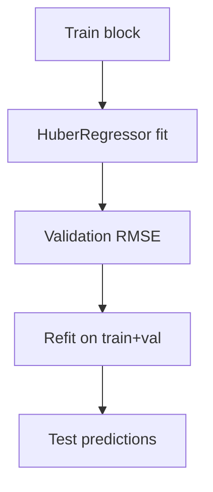

# ols3_huber.py

## Purpose
Restricted robust linear baseline using only `me`, `be_me`, and `ret_12_1`. Source: `/model/src/v2_model/models/ols3_huber.py`.

## Where it sits in the pipeline
Called by `/model/src/v2_model/pipeline.py` inside each rolling train/validation/test window. The file returns a standardized `WindowFitResult` so the rest of the pipeline can treat different model families uniformly.

## Inputs
- `X_train`, `y_train`
- `X_val`, `y_val`
- `X_test`
- model-specific hyperparameters from config

## Outputs / side effects
- returns a `WindowFitResult`
- no direct file writes; output persistence is handled by `pipeline.py`

## How the code works
HuberRegressor with fixed 3-feature design

## Core Code
```python
from __future__ import annotations

import numpy as np

from .ols_huber import run_window as run_window_ols_huber
from .base import WindowFitResult


def run_window(
    X_train: np.ndarray,
    y_train: np.ndarray,
    X_val: np.ndarray,
    y_val: np.ndarray,
    X_test: np.ndarray,
    *,
    max_iter: int = 1000,
) -> WindowFitResult:
    return run_window_ols_huber(
        X_train=X_train,
        y_train=y_train,
        X_val=X_val,
        y_val=y_val,
        X_test=X_test,
        max_iter=max_iter,
    )
```

## Math / logic
$$\min_{\beta,c} \sum_i L_\epsilon(y_i - x_i^\top \beta - c) + \alpha ||\beta||_2^2$$

where `HuberRegressor` uses a robust Huber-style objective rather than closed-form OLS.

## Worked Example
If one stock-month has a very large positive residual, the Huber objective downweights that observation relative to pure squared loss. That makes the fitted coefficients less sensitive to outliers than ordinary least squares.

## Visual Flow


## What depends on it
- `/model/src/v2_model/pipeline.py`
- summary and portfolio construction downstream through the shared `WindowFitResult`

## Important caveats / assumptions
Despite the file name, this is not closed-form OLS. It is a robust linear model.

## Linked Notes
- [Pipeline orchestrator](17_src_v2_model_pipeline.md)
- [Base model utilities](19_src_v2_model_models_base.md)
- [Main notebook](05_notebooks_00_run_and_review_model.md)

