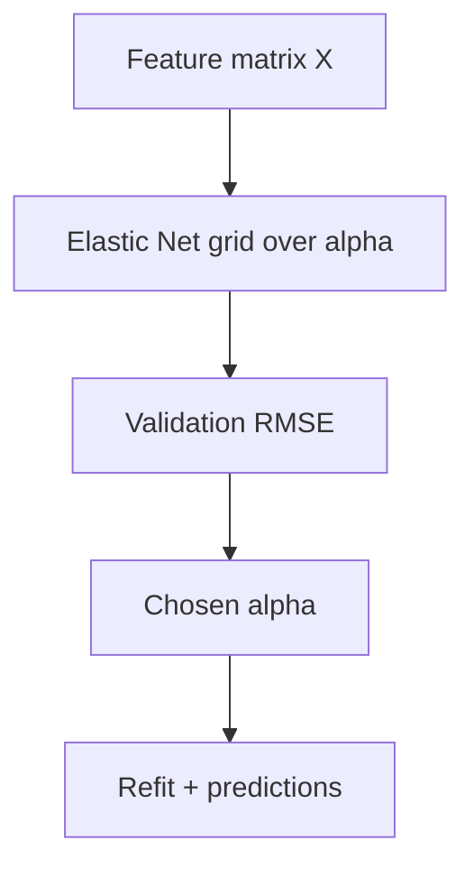

# enet.py

## Purpose
Elastic Net model with validation over penalty strength. Source: `/model/src/v2_model/models/enet.py`.

## Where it sits in the pipeline
Called by `/model/src/v2_model/pipeline.py` inside each rolling train/validation/test window. The file returns a standardized `WindowFitResult` so the rest of the pipeline can treat different model families uniformly.

## Inputs
- `X_train`, `y_train`
- `X_val`, `y_val`
- `X_test`
- model-specific hyperparameters from config

## Outputs / side effects
- returns a `WindowFitResult`
- no direct file writes; output persistence is handled by `pipeline.py`

## How the code works
ElasticNet grid over alpha

## Core Code
```python
from __future__ import annotations

import warnings

import numpy as np
from sklearn.exceptions import ConvergenceWarning
from sklearn.linear_model import ElasticNet

from .base import WindowFitResult, rmse


def _alpha_grid(alpha_start: float, alpha_stop: float, alpha_num: int) -> np.ndarray:
    return np.linspace(float(alpha_start), float(alpha_stop), int(alpha_num))


def run_window(
    X_train: np.ndarray,
    y_train: np.ndarray,
    X_val: np.ndarray,
    y_val: np.ndarray,
    X_test: np.ndarray,
    *,
    alpha_start: float = 0.00001,
    alpha_stop: float = 0.004,
    alpha_num: int = 20,
    l1_ratio: float = 0.5,
    max_iter: int = 10000,
    random_state: int = 42,
) -> WindowFitResult:
    alphas = _alpha_grid(alpha_start, alpha_stop, alpha_num)

    best_alpha = None
    best_rmse = np.inf

    for alpha in alphas:
        model = ElasticNet(
            alpha=float(alpha),
            l1_ratio=float(l1_ratio),
            fit_intercept=True,
            max_iter=int(max_iter),
            random_state=int(random_state),
        )
        with warnings.catch_warnings():
            warnings.simplefilter("ignore", category=ConvergenceWarning)
            model.fit(X_train, y_train)

        y_val_pred = model.predict(X_val)
        cur_rmse = rmse(y_val, y_val_pred)
        if cur_rmse < best_rmse:
            best_rmse = cur_rmse
            best_alpha = float(alpha)

    X_tv = np.vstack([X_train, X_val])
    y_tv = np.concatenate([y_train, y_val])

    model = ElasticNet(
        alpha=float(best_alpha),
        l1_ratio=float(l1_ratio),
        fit_intercept=True,
        max_iter=int(max_iter),
        random_state=int(random_state),
    )
    with warnings.catch_warnings():
        warnings.simplefilter("ignore", category=ConvergenceWarning)
        model.fit(X_tv, y_tv)

    y_pred = model.predict(X_test)
    n_nonzero = int(np.count_nonzero(np.abs(model.coef_) > 0))

    return WindowFitResult(
        y_pred=y_pred,
        best_params={"alpha": float(best_alpha), "l1_ratio": float(l1_ratio), "max_iter": int(max_iter)},
        best_score=float(best_rmse),
        complexity={"n_nonzero_coef": n_nonzero},
        fitted_model=model,
    )
```

## Math / logic
$$\min_{\beta} \frac{1}{n}\sum_i (y_i - x_i^\top \beta)^2 + \alpha\left(l_1 ||\beta||_1 + \frac{1-l_1}{2}||\beta||_2^2\right)$$

## Worked Example
With many correlated predictors, Elastic Net can shrink a large set down to a smaller active subset by driving some coefficients toward zero while keeping grouped signals alive.

## Visual Flow


## What depends on it
- `/model/src/v2_model/pipeline.py`
- summary and portfolio construction downstream through the shared `WindowFitResult`

## Important caveats / assumptions
The active implementation fixes `l1_ratio` from config rather than searching a broad l1/l2 mix grid.

## Linked Notes
- [Pipeline orchestrator](17_src_v2_model_pipeline.md)
- [Base model utilities](19_src_v2_model_models_base.md)
- [Main notebook](05_notebooks_00_run_and_review_model.md)

