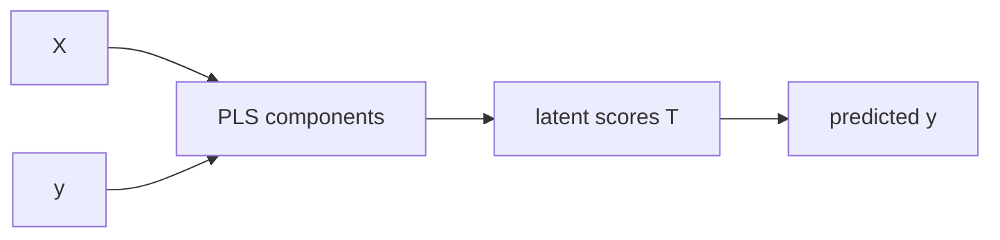

# pls.py

## Purpose
Partial least squares regression over a validation-tuned component count. Source: `/model/src/v2_model/models/pls.py`.

## Where it sits in the pipeline
Called by `/model/src/v2_model/pipeline.py` inside each rolling train/validation/test window. The file returns a standardized `WindowFitResult` so the rest of the pipeline can treat different model families uniformly.

## Inputs
- `X_train`, `y_train`
- `X_val`, `y_val`
- `X_test`
- model-specific hyperparameters from config

## Outputs / side effects
- returns a `WindowFitResult`
- no direct file writes; output persistence is handled by `pipeline.py`

## How the code works
PLSRegression tuned on n_components

## Core Code
```python
from __future__ import annotations

import numpy as np
from sklearn.cross_decomposition import PLSRegression

from .base import WindowFitResult, rmse


def _valid_components(components: list[int], n_features: int, n_rows: int) -> list[int]:
    cap = max(1, min(int(n_features), int(n_rows)))
    vals = sorted({int(c) for c in components if int(c) >= 1 and int(c) <= cap})
    return vals or [1]


def run_window(
    X_train: np.ndarray,
    y_train: np.ndarray,
    X_val: np.ndarray,
    y_val: np.ndarray,
    X_test: np.ndarray,
    *,
    components: list[int],
) -> WindowFitResult:
    comps = _valid_components(components, n_features=X_train.shape[1], n_rows=X_train.shape[0])

    best_k = None
    best_rmse = np.inf

    for k in comps:
        model = PLSRegression(n_components=int(k), scale=False)
        model.fit(X_train, y_train)
        y_val_pred = model.predict(X_val).ravel()
        cur_rmse = rmse(y_val, y_val_pred)
        if cur_rmse < best_rmse:
            best_rmse = cur_rmse
            best_k = int(k)

    X_tv = np.vstack([X_train, X_val])
    y_tv = np.concatenate([y_train, y_val])
    model = PLSRegression(n_components=int(best_k), scale=False)
    model.fit(X_tv, y_tv)
    y_pred = model.predict(X_test).ravel()

    return WindowFitResult(
        y_pred=y_pred,
        best_params={"n_components": int(best_k)},
        best_score=float(best_rmse),
        complexity={"n_components": int(best_k)},
        fitted_model=model,
    )
```

## Math / logic
$$T = XW, \quad y pprox Tq$$

PLS builds latent components that maximize covariance with the target.

## Worked Example
If two raw predictors move together but also align with next-month return, PLS can compress them into one supervised latent factor instead of keeping both separately.

## Visual Flow


## What depends on it
- `/model/src/v2_model/pipeline.py`
- summary and portfolio construction downstream through the shared `WindowFitResult`

## Important caveats / assumptions
PLS is supervised compression; unlike PCR, the target influences the component construction.

## Linked Notes
- [Pipeline orchestrator](17_src_v2_model_pipeline.md)
- [Base model utilities](19_src_v2_model_models_base.md)
- [Main notebook](05_notebooks_00_run_and_review_model.md)

