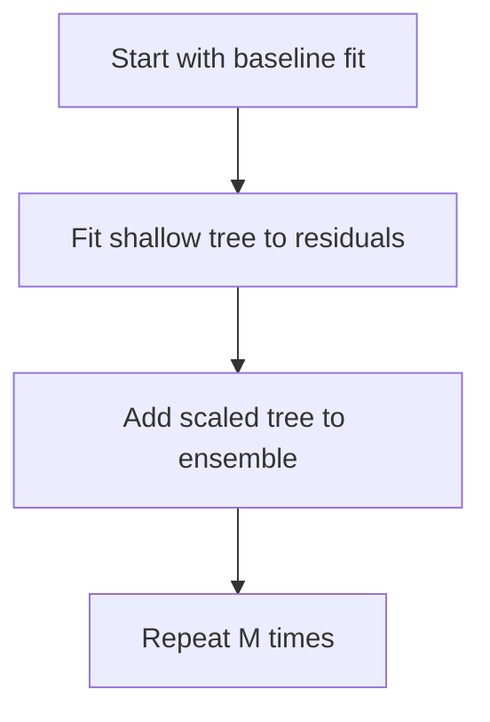

# gbrt.py

## Purpose
Gradient boosted regression trees validated on Huber loss. Source: `/model/src/v2_model/models/gbrt.py`.

## Where it sits in the pipeline
Called by `/model/src/v2_model/pipeline.py` inside each rolling train/validation/test window. The file returns a standardized `WindowFitResult` so the rest of the pipeline can treat different model families uniformly.

## Inputs
- `X_train`, `y_train`
- `X_val`, `y_val`
- `X_test`
- model-specific hyperparameters from config

## Outputs / side effects
- returns a `WindowFitResult`
- no direct file writes; output persistence is handled by `pipeline.py`

## How the code works
GradientBoostingRegressor with shallow-tree grid

## Core Code
```python
from __future__ import annotations

import numpy as np
from sklearn.ensemble import GradientBoostingRegressor
from sklearn.model_selection import ParameterGrid

from .base import WindowFitResult, huber_loss_error


def run_window(
    X_train: np.ndarray,
    y_train: np.ndarray,
    X_val: np.ndarray,
    y_val: np.ndarray,
    X_test: np.ndarray,
    *,
    max_depth: list[int],
    n_estimators: list[int],
    learning_rate: list[float],
    max_features: list,
    min_samples_split: list[int],
    min_samples_leaf: list[int],
    huber_delta: float = 1.35,
    random_state: int = 42,
) -> WindowFitResult:
    grid = list(
        ParameterGrid(
            {
                "max_depth": max_depth,
                "n_estimators": n_estimators,
                "learning_rate": learning_rate,
                "max_features": max_features,
                "min_samples_split": min_samples_split,
                "min_samples_leaf": min_samples_leaf,
            }
        )
    )

    best_loss = np.inf
    best_params = None

    for p in grid:
        model = GradientBoostingRegressor(
            loss="huber",
            max_depth=int(p["max_depth"]),
            n_estimators=int(p["n_estimators"]),
            learning_rate=float(p["learning_rate"]),
            max_features=p["max_features"],
            min_samples_split=int(p["min_samples_split"]),
            min_samples_leaf=int(p["min_samples_leaf"]),
            random_state=int(random_state),
        )
        model.fit(X_train, y_train)
        y_val_pred = model.predict(X_val)
        loss = huber_loss_error(y_val, y_val_pred, delta=float(huber_delta))
        if loss < best_loss:
            best_loss = float(loss)
            best_params = p

    X_tv = np.vstack([X_train, X_val])
    y_tv = np.concatenate([y_train, y_val])
    model = GradientBoostingRegressor(
        loss="huber",
        max_depth=int(best_params["max_depth"]),
        n_estimators=int(best_params["n_estimators"]),
        learning_rate=float(best_params["learning_rate"]),
        max_features=best_params["max_features"],
        min_samples_split=int(best_params["min_samples_split"]),
        min_samples_leaf=int(best_params["min_samples_leaf"]),
        random_state=int(random_state),
    )
    model.fit(X_tv, y_tv)
    y_pred = model.predict(X_test)

    complexity = {
        "best_max_depth": int(best_params["max_depth"]),
        "best_min_samples_split": int(best_params["min_samples_split"]),
        "best_min_samples_leaf": int(best_params["min_samples_leaf"]),
        "best_learning_rate": float(best_params["learning_rate"]),
    }

    return WindowFitResult(
        y_pred=y_pred,
        best_params={k: (int(v) if isinstance(v, (int, np.integer)) else v) for k, v in best_params.items()},
        best_score=float(best_loss),
        complexity=complexity,
        fitted_model=model,
    )
```

## Math / logic
$$f_M(x) = \sum_{m=1}^{M} \nu \, h_m(x)$$

Gradient boosting adds shallow trees sequentially, with learning rate $\nu$ and validation on Huber loss.

## Worked Example
A depth-1 tree can behave like a threshold rule: if momentum is above a split, add a positive increment; otherwise add a negative one. Boosting stacks many such rules.

## Visual Flow


## What depends on it
- `/model/src/v2_model/pipeline.py`
- summary and portfolio construction downstream through the shared `WindowFitResult`

## Important caveats / assumptions
Shallow trees can produce coarse tied predictions, which matters for decile portfolio construction.

## Linked Notes
- [Pipeline orchestrator](17_src_v2_model_pipeline.md)
- [Base model utilities](19_src_v2_model_models_base.md)
- [Main notebook](05_notebooks_00_run_and_review_model.md)

