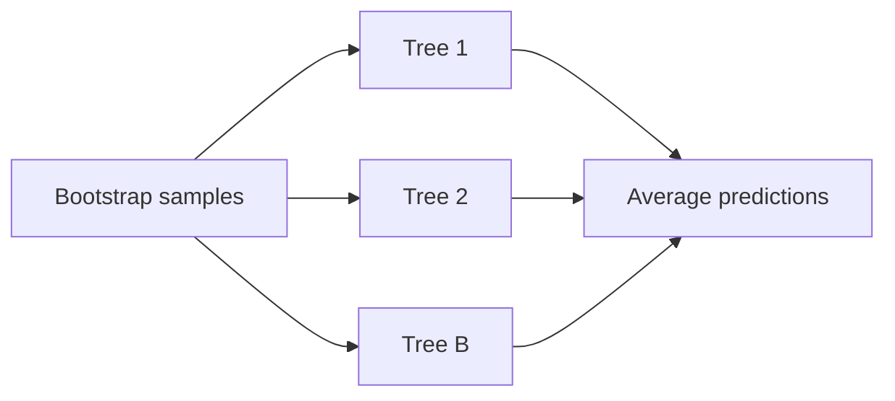

# rf.py

## Purpose
Random forest regression validated on MSE. Source: `/model/src/v2_model/models/rf.py`.

## Where it sits in the pipeline
Called by `/model/src/v2_model/pipeline.py` inside each rolling train/validation/test window. The file returns a standardized `WindowFitResult` so the rest of the pipeline can treat different model families uniformly.

## Inputs
- `X_train`, `y_train`
- `X_val`, `y_val`
- `X_test`
- model-specific hyperparameters from config

## Outputs / side effects
- returns a `WindowFitResult`
- no direct file writes; output persistence is handled by `pipeline.py`

## How the code works
RandomForestRegressor with depth/max_features search

## Core Code
```python
from __future__ import annotations

import numpy as np
from sklearn.ensemble import RandomForestRegressor
from sklearn.metrics import mean_squared_error
from sklearn.model_selection import ParameterGrid

from .base import WindowFitResult


def run_window(
    X_train: np.ndarray,
    y_train: np.ndarray,
    X_val: np.ndarray,
    y_val: np.ndarray,
    X_test: np.ndarray,
    *,
    max_depth: list[int],
    max_features: list[int],
    n_estimators: int = 100,
    random_state: int = 42,
    n_jobs: int = -1,
) -> WindowFitResult:
    grid = list(ParameterGrid({"max_depth": max_depth, "max_features": max_features}))

    best_mse = np.inf
    best_params = None

    for p in grid:
        model = RandomForestRegressor(
            bootstrap=True,
            n_estimators=int(n_estimators),
            max_depth=int(p["max_depth"]),
            max_features=int(p["max_features"]),
            random_state=int(random_state),
            n_jobs=int(n_jobs),
        )
        model.fit(X_train, y_train)
        y_val_pred = model.predict(X_val)
        mse = float(mean_squared_error(y_val, y_val_pred))
        if mse < best_mse:
            best_mse = mse
            best_params = p

    X_tv = np.vstack([X_train, X_val])
    y_tv = np.concatenate([y_train, y_val])
    model = RandomForestRegressor(
        bootstrap=True,
        n_estimators=int(n_estimators),
        max_depth=int(best_params["max_depth"]),
        max_features=int(best_params["max_features"]),
        random_state=int(random_state),
        n_jobs=int(n_jobs),
    )
    model.fit(X_tv, y_tv)
    y_pred = model.predict(X_test)

    return WindowFitResult(
        y_pred=y_pred,
        best_params={"max_depth": int(best_params["max_depth"]), "max_features": int(best_params["max_features"]), "n_estimators": int(n_estimators)},
        best_score=float(best_mse),
        complexity={"best_max_depth": int(best_params["max_depth"]), "best_max_features": int(best_params["max_features"])},
        fitted_model=model,
    )
```

## Math / logic
$$\hat y(x) = \frac{1}{B} \sum_{b=1}^{B} T_b(x)$$

## Worked Example
Each tree sees a bootstrap sample and a restricted feature subset. Averaging many trees reduces variance relative to a single tree.

## Visual Flow


## What depends on it
- `/model/src/v2_model/pipeline.py`
- summary and portfolio construction downstream through the shared `WindowFitResult`

## Important caveats / assumptions
The implementation tunes only a compact subset of tree hyperparameters; it is not an exhaustive forest search.

## Linked Notes
- [Pipeline orchestrator](17_src_v2_model_pipeline.md)
- [Base model utilities](19_src_v2_model_models_base.md)
- [Main notebook](05_notebooks_00_run_and_review_model.md)

