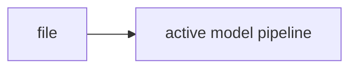

# tests/test_schema.py

## Purpose
Test/support file describing or enforcing part of the active model contract. Source: `/model/tests/test_schema.py`.

## Where it sits in the pipeline
This file supports the active model pipeline and is part of the maintained code path.

## Inputs
- Code-level inputs vary by caller; see the core code snippet below.
 
## Outputs / side effects
- Depends on caller; configuration, path resolution, testing, or derived tables depending on the file.
 
## How the code works
The file is part of the active `version_2/model` implementation and should be read together with the linked notes for the surrounding workflow.

## Core Code
```python
import pandas as pd

from v2_model.schema import validate_benchmark_schema, validate_panel_schema


def test_validate_panel_schema_ok():
    panel = pd.DataFrame({
        'id': ['A', 'A'],
        'eom': ['2020-01-31', '2020-02-29'],
        'prc': [10.0, 11.0],
        'me': [100000.0, 120000.0],
        'ret': [0.02, 0.01],
        'ret_exc': [0.018, 0.009],
        'ret_exc_lead1m': [0.009, 0.005],
        'be_me': [0.8, 0.85],
        'ret_12_1': [0.10, 0.12],
    })
    report = validate_panel_schema(panel)
    assert report.n_rows == 2
    assert report.n_assets == 1


def test_validate_benchmark_schema_ok():
    bench = pd.DataFrame({'eom': ['2020-01-31', '2020-02-29'], 'benchmark_ret': [0.01, 0.02]})
    report = validate_benchmark_schema(bench)
    assert report.n_rows == 2
```

## Math / logic
Use the linked notes for the main pipeline math. This file is mostly structural support around the active model workflow.

## Worked Example
Example: this file participates when the notebook calls the CLI or when the pipeline builds/validates rolling windows and output artifacts.

## Visual Flow


## What depends on it
- Other active files in `/model/src/v2_model` and the notebooks.

## Important caveats / assumptions
- This note focuses on the active code only. `model/not_working` is excluded from the maintained manuals.

## Linked Notes
- [Pipeline map](00_version_2_model_pipeline_map.md)
- [Pipeline orchestrator](17_src_v2_model_pipeline.md)

