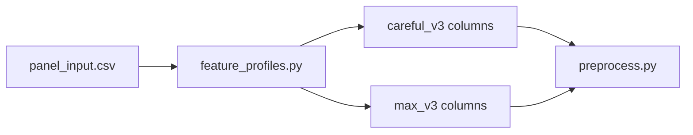

# feature_profiles.py

## Purpose
Defines the active feature-profile system for the model pipeline. It is the source of truth for required monthly schema columns, the Batch 2 base feature set, the `careful_v3` additions, and the `max_v3` only additions. Source: `/model/src/v2_model/feature_profiles.py`.

## Where it sits in the pipeline
Loaded by `/model/src/v2_model/preprocess.py` to decide which optional columns are kept for modeling, and by documentation/config workflows to understand profile width.

## Inputs
- The module itself contains no runtime file input.
- It operates on the assumption that `/model/data/panel_input.csv` has already been built with the superset of monthly features.

## Outputs / side effects
It exports constants and helper functions:
- `REQUIRED_PANEL_COLS`
- `BATCH2_BASE_FEATURES`
- `CAREFUL_V3_ADDITIONS`
- `MAX_V3_ONLY_ADDITIONS`
- `FEATURE_PROFILES`
- `MAX_PANEL_FEATURES`
- `feature_profile_columns(profile)`

## How the code works
The file first pins the 9 required schema columns, then defines the baseline optional predictors, then appends staged expansion lists. `careful_v3` is the Batch 2 base plus 9 additions. `max_v3` is `careful_v3` plus a much wider block of macro-change, OHLC/TRI, ratio, growth, and interaction features.

## Core Code
```python
# Required monthly schema columns that every profile must keep.
REQUIRED_PANEL_COLS = [
    'id', 'eom', 'prc', 'me', 'ret', 'ret_exc', 'ret_exc_lead1m', 'be_me', 'ret_12_1'
]

# Batch 2 base optional predictors.
BATCH2_BASE_FEATURES = [
    'Bid_Ask', 'Free_Float_Pct', 'Shares_Out', 'age', 'adv_med', 'dollar_vol',
    'turn', 'std_turn', 'maxret', 'idiovol', 'FCF', 'cfp', 'dy', 'ep', 'gma',
    'lev', 'cash_ratio', 'roeq', 'agr', 'chcsho', 'chinv', 'pchsale_pchinvt',
    'mom1m', 'mom6m', 'mom36m', 'Textile_Cotton_Price', 'Comm_Brent_Oil',
    'Comm_Copper', 'Comm_Gold_Spot', 'Comm_Natural_Gas', 'Global_Baltic_Dry',
    'USD_CNY_FX', 'USD_VND_FX', 'US_Bond_10Y', 'US_CPI_YoY', 'US_Dollar_Index',
    'US_FedFunds_Rate', 'US_GDP_QoQ', 'US_Market_SP500', 'US_Volatility_VIX',
    'VN_CPI_YoY', 'VN_Market_Index', 'VN_MoneySupply_M2',
]

# Smaller Batch 3 expansion.
CAREFUL_V3_ADDITIONS = [
    'Hong_Kong_Index', 'Indonesia_Index', 'Philippines_Index', 'Thailand_Index',
    'China_Shanghai_Index', 'VN_DIAMOND_INDEX', 'Vol_30D', 'Vol_90D', 'tri_ret_12_1'
]

# Wider Batch 3 expansion.
FEATURE_PROFILES = {
    'careful_v3': BATCH2_BASE_FEATURES + CAREFUL_V3_ADDITIONS,
    'max_v3': BATCH2_BASE_FEATURES + CAREFUL_V3_ADDITIONS + MAX_V3_ONLY_ADDITIONS,
}
```

## Math / logic
$$\text{{careful\_v3}} = \text{{base features}} + \text{{9 careful additions}}$$

$$\text{{max\_v3}} = \text{{careful\_v3}} + \text{{max-only additions}}$$

This file is not doing estimation itself. It is choosing the columns that define the model input matrix $X$.

## Worked Example
If `panel_input.csv` contains both `careful_v3` and `max_v3` columns, then:
- `feature_profile_columns("careful_v3")` returns the narrower list used by the careful profile
- `feature_profile_columns("max_v3")` returns the full wide list

So the same monthly panel can feed both experiments without rebuilding the panel itself.

## Visual Flow


## What depends on it
- `/model/src/v2_model/preprocess.py`
- `/model/src/v2_model/config.py`
- `/model/src/v2_model/pipeline.py` indirectly through `feature_cols`
- profile-specific configs and notebooks

## Important caveats / assumptions
- The file defines profile membership only; it does not guarantee the columns are populated.
- `max_v3` widens feature breadth substantially and increases missingness pressure.

## Linked Notes
- [Pipeline map](00_version_2_model_pipeline_map.md)
- [Default config](03_configs_default_yaml.md)
- [careful_v3 config](35_configs_careful_v3_yaml.md)
- [max_v3 config](36_configs_max_v3_yaml.md)
- [Preprocess step](12_src_v2_model_preprocess.md)

