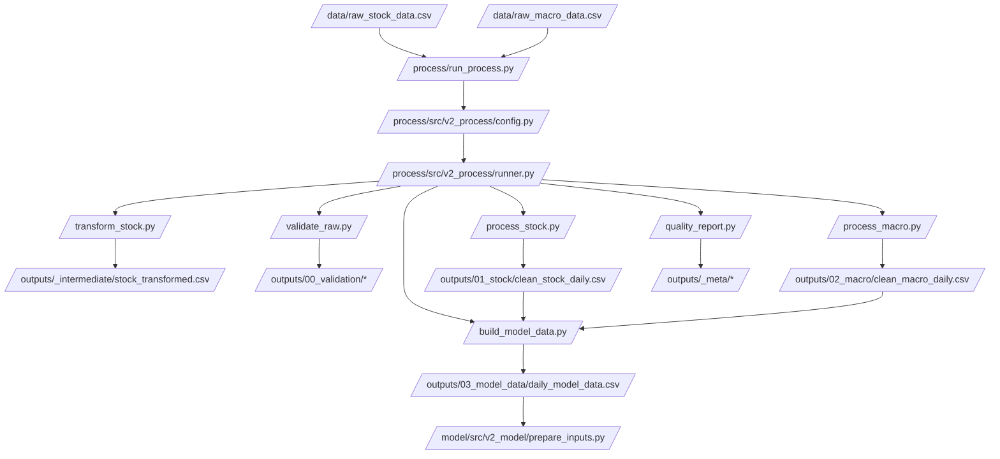

# version_2 Process Pipeline Map

## Purpose
This note is the high-level manual for the active `/process` pipeline in `version_2`. It shows how raw daily stock and macro data move through the processing stages, which artifacts each stage writes, and how the final daily model dataset is handed to the `/model` pipeline.

## Where it sits in the pipeline
`/process` is the upstream daily data-preparation layer. It starts from raw CSVs in `/data` and ends at one merged daily panel:

- `/process/outputs/03_model_data/daily_model_data.csv`

That file is then consumed by `/model/src/v2_model/prepare_inputs.py` to build the monthly panel used by the models.

## Inputs
Primary external inputs:
- `/data/raw_stock_data.csv`
- `/data/raw_macro_data.csv`

Config and entrypoint:
- `/process/run_process.py`
- `/process/configs/default.yaml`

## Outputs / side effects
Main artifacts:
- `/process/outputs/00_validation/raw_stock_summary.csv`
- `/process/outputs/00_validation/raw_stock_missing_share.csv`
- `/process/outputs/00_validation/raw_macro_missing_share.csv`
- `/process/outputs/01_stock/clean_stock_daily.csv`
- `/process/outputs/01_stock/clean_stock_summary.csv`
- `/process/outputs/02_macro/clean_macro_daily.csv`
- `/process/outputs/02_macro/macro_missing_share.csv`
- `/process/outputs/03_model_data/macro_lagged_daily.csv`
- `/process/outputs/03_model_data/macro_release_lag_diagnostics.csv`
- `/process/outputs/03_model_data/daily_model_data.csv`
- `/process/outputs/_meta/run_manifest.json`
- `/process/outputs/_meta/stage_timings.csv`
- `/process/outputs/_meta/quality_gates.csv`

## How the code works
The active stage order is defined in `/process/src/v2_process/runner.py`:

1. `transform`
2. `validate`
3. `process_stock`
4. `process_macro`
5. `build_model`

The runner carries a `context` dictionary forward. Each stage writes artifact paths into `context`, and later stages read those paths instead of rediscovering files manually. This keeps the pipeline deterministic and easy to trace.

### Stage-to-stage lineage
| Stage | Code file | Reads | Writes | Context keys added |
| --- | --- | --- | --- | --- |
| `transform` | `/process/src/v2_process/stages/transform_stock.py` | raw stock CSV | transformed stock CSV | `stock_transformed_csv` |
| `validate` | `/process/src/v2_process/stages/validate_raw.py` | transformed stock, raw macro | validation summaries | `raw_stock_summary`, `raw_stock_missing_share`, `raw_macro_missing_share` |
| `process_stock` | `/process/src/v2_process/stages/process_stock.py` | transformed stock | clean stock daily, stock summary | `stock_clean_csv`, `stock_clean_summary` |
| `process_macro` | `/process/src/v2_process/stages/process_macro.py` | raw macro | clean macro daily, missingness table | `macro_base_csv`, `macro_missing_share` |
| `build_model` | `/process/src/v2_process/stages/build_model_data.py` | clean stock daily, clean macro daily | lagged macro, diagnostics, merged model data | `model_data_csv`, `macro_lagged_csv`, `macro_lag_diag_csv` |

## Core Code
Core orchestration: run each stage in order, merge output paths into shared context, then write the run manifest.

```python
STAGE_ORDER = [
    'transform',
    'validate',
    'process_stock',
    'process_macro',
    'build_model',
]

context = {
    'stock_raw_csv': str(config.inputs.stock_raw_csv),
    'macro_raw_csv': str(config.inputs.macro_raw_csv),
}

for stage in stages:
    fn = STAGE_FUNCS[stage]                 # pick the stage implementation
    out = fn(config=config, paths=paths, context=context)
    context.update(out.get('outputs', {}))  # pass artifact paths forward

quality_report.write_meta(
    config=config,
    paths=paths,
    config_path=str(config_path),
    started_at=started_at,
    stage_results=stage_results,
    context=context,
    stage_order=stages,
)
```

## Math / logic
The pipeline has two different kinds of shrinkage:

1. **Daily cleaning shrinkage** inside `/process`
2. **Daily-to-monthly collapse** later inside `/model`

Within `/process`, the most important stock filter is the hole-date filter:

$$
\text{keep date } t \iff
\begin{cases}
\text{count}_t \ge \text{min\_stocks\_early}, & \text{if baseline}_t \text{ is unavailable} \\
\text{count}_t \ge \text{min\_rel} \times \text{baseline}_t, & \text{otherwise}
\end{cases}
$$

where $\text{baseline}_t$ is the rolling median cross-sectional breadth over the previous `roll_days`.

## Worked Example
Current run snapshot:

- raw stock rows: `2,442,773`
- raw stock tickers: `699`
- clean stock rows: `2,252,579`
- dropped hole dates: `130`

So the active `/process` pipeline is **not** the place where most rows disappear. Most row-count shrinkage happens later when daily data is collapsed into monthly stock-month observations in `/model`.

## Visual Flow


## What depends on it
Direct downstream consumer:
- [Model monthly input preparation](../version_2_model_docs/11_src_v2_model_prepare_inputs.md) in the separate model manual pack

Within the process pack, all detailed stage notes depend on this high-level map as the navigation anchor.

## Important caveats / assumptions
- This note describes the **active** `version_2/process` code only.
- It does not cover archived experiments or the inactive `/model/not_working` folder.
- The handoff to `/model` is through `daily_model_data.csv`, not directly to `panel_input.csv`.
- The current summaries and worked-example counts assume the latest available local process outputs are present.

## Linked Notes
- [Process README](01_README.md)
- [run_process.py](02_run_process.md)
- [Process config](03_configs_default_yaml.md)
- [Runner](09_src_v2_process_runner.md)
- [Transform stock stage](11_src_v2_process_stages_transform_stock.md)
- [Validate raw stage](12_src_v2_process_stages_validate_raw.md)
- [Process stock stage](13_src_v2_process_stages_process_stock.md)
- [Process macro stage](14_src_v2_process_stages_process_macro.md)
- [Build model data stage](15_src_v2_process_stages_build_model_data.md)
- [Quality report stage](16_src_v2_process_stages_quality_report.md)
- [Process notebook](17_notebooks_00_run_and_review_process.md)
