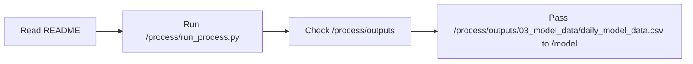

# Process README

## Purpose
This note explains what `/process/README.md` communicates to a reader or operator: the role of the daily process pipeline, how to run it, and what outputs it is supposed to produce.

## Where it sits in the pipeline
The README is the human entrypoint for `/process`. It is not executable code, but it defines the operating boundary between:
- raw daily inputs in `/data`
- daily processed outputs in `/process/outputs`
- monthly modeling work in `/model`

## Inputs
Source note:
- `/process/README.md`

The README describes these runtime inputs:
- `/data/raw_stock_data.csv`
- `/data/raw_macro_data.csv`

## Outputs / side effects
The README itself writes nothing. It documents the expected outputs:
- validation summaries
- clean daily stock data
- clean daily macro data
- merged daily model data
- metadata and run manifest

## How the code works
The README is organized around three operator questions:
1. what the pipeline is for
2. how to run it
3. what it produces

It also makes clear that `/process` stops at the daily merged dataset and that `/model` owns monthly preparation and model fitting.

## Core Code
Core README command example.

```bash
# Run the full process pipeline from the project root.
cd /process
PYTHONPATH=src python run_process.py --config configs/default.yaml --stages all
```

## Math / logic
No math is implemented in the README. Its logic is operational rather than numerical.

## Worked Example
If you follow the README command, the key output to verify is:

- `/process/outputs/03_model_data/daily_model_data.csv`

That file is the handoff into the monthly model pipeline.

## Visual Flow


## What depends on it
Human operators depend on the README before using:
- [run_process.py](02_run_process.md)
- [Process notebook](17_notebooks_00_run_and_review_process.md)

## Important caveats / assumptions
- The README is intentionally short; the detailed behavior lives in the stage notes.
- It assumes the raw CSVs already exist in `/data`.

## Linked Notes
- [Pipeline map](00_version_2_process_pipeline_map.md)
- [run_process.py](02_run_process.md)
- [Process config](03_configs_default_yaml.md)
- [Process notebook](17_notebooks_00_run_and_review_process.md)
