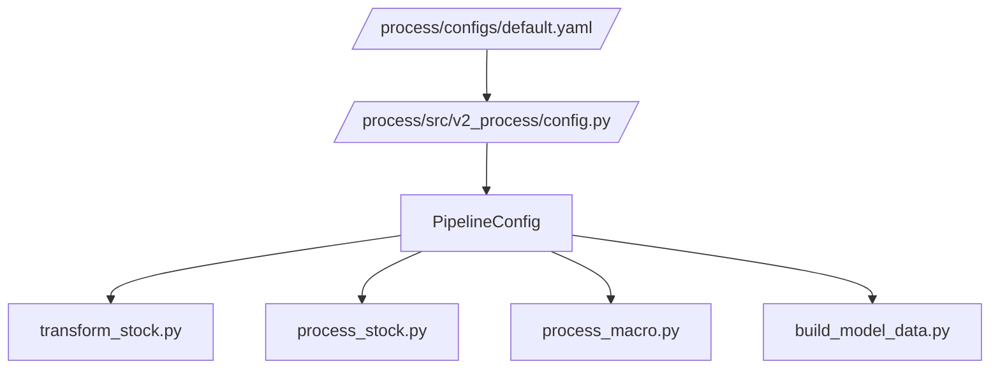

# default.yaml

## Purpose
This note documents `/process/configs/default.yaml`, the active configuration file for the process pipeline.

## Where it sits in the pipeline
The YAML file is the external control surface for `/process`. `run_process.py` passes it to `config.py`, which converts it into the typed dataclasses used by all stages.

## Inputs
- `/process/configs/default.yaml`
- consumed by `/process/src/v2_process/config.py`

## Outputs / side effects
The YAML file itself writes nothing. Its values determine:
- raw input locations
- output root
- stock cleaning thresholds
- macro release lags

## How the code works
The config has four active sections:

### `paths.input`
Defines the raw CSV inputs:
- `stock_raw_csv`
- `macro_raw_csv`

### `paths.output`
Defines the process output root:
- `root_dir`

### `cleaning`
Controls stock-side processing:
- `start_date`
- `roll_days`
- `min_base_days`
- `min_rel`
- `min_stocks_early`
- `min_price`
- `liq_win`
- `liq_minp`
- `target_clip`
- `outlier_abs_ret_flag`
- `stale_limit_days`

### `macro`
Controls macro processing:
- `max_missing_share`
- `release_lags`

## Core Code
Core config excerpt.

```yaml
paths:
  input:
    stock_raw_csv: ../data/raw_stock_data.csv
    macro_raw_csv: ../data/raw_macro_data.csv
  output:
    root_dir: ./outputs

cleaning:
  start_date: '2000-01-01'
  roll_days: 252
  min_base_days: 60
  min_rel: 0.70
  min_stocks_early: 300
  min_price: 1000.0
  liq_win: 60
  liq_minp: 20
  target_clip: 0.50
  outlier_abs_ret_flag: 1.0
  stale_limit_days: 252
```

## Math / logic
The most important stock-date filter controlled here is the hole-date rule:

$$
\text{count}_t \ge \text{min\_rel} \times \text{baseline}_t
$$

with fallback:

$$
\text{count}_t \ge \text{min\_stocks\_early}
$$

when the rolling baseline is not yet available.

The macro config also defines release-lag offsets:

$$
\text{release date} = \text{event date} + \text{lag days}
$$

with a next-business-day adjustment applied in code.

## Worked Example
Current active values imply:
- stock raw file is expected at `/data/raw_stock_data.csv`
- macro raw file is expected at `/data/raw_macro_data.csv`
- dates before `2000-01-01` are removed in stock processing
- a date can survive hole-date filtering if it has at least `70%` of the rolling baseline breadth
- slow features can be forward-filled up to `252` trading days inside `/process_stock`

## Visual Flow


## What depends on it
Active consumers:
- [run_process.py](02_run_process.md)
- [Config loader](05_src_v2_process_config.md)
- [Transform stock stage](11_src_v2_process_stages_transform_stock.md)
- [Process stock stage](13_src_v2_process_stages_process_stock.md)
- [Process macro stage](14_src_v2_process_stages_process_macro.md)
- [Build model data stage](15_src_v2_process_stages_build_model_data.md)

## Important caveats / assumptions
- `target_clip` and `outlier_abs_ret_flag` are exposed here, but the active stock-processing stage still hard-codes those thresholds in its internal helper.
- This config does **not** contain any liquidity-screen keep-share because liquidity filtering was moved out of `/process`.

## Linked Notes
- [Pipeline map](00_version_2_process_pipeline_map.md)
- [run_process.py](02_run_process.md)
- [Config loader](05_src_v2_process_config.md)
- [Contracts](06_src_v2_process_contracts.md)
- [Process stock stage](13_src_v2_process_stages_process_stock.md)
- [Process macro stage](14_src_v2_process_stages_process_macro.md)
