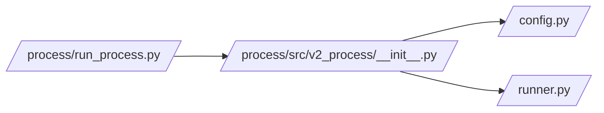

# __init__.py

## Purpose
This note documents `/process/src/v2_process/__init__.py`, the small export layer for the process package.

## Where it sits in the pipeline
It sits at the package root and gives the entrypoint a cleaner import surface.

## Inputs
- `/process/src/v2_process/__init__.py`

## Outputs / side effects
No file outputs. It re-exports symbols for easier imports.

## How the code works
The file imports and exposes:
- `load_config`
- `STAGE_ORDER`
- `run_pipeline`

So `/process/run_process.py` can import from `v2_process` directly instead of reaching into multiple modules.

## Core Code
```python
from .config import load_config
from .runner import STAGE_ORDER, run_pipeline
```

## Math / logic
No numerical logic lives here.

## Worked Example
Instead of writing:

```python
from v2_process.config import load_config
from v2_process.runner import STAGE_ORDER, run_pipeline
```

client code can simply write:

```python
from v2_process import load_config, STAGE_ORDER, run_pipeline
```

## Visual Flow


## What depends on it
- [run_process.py](02_run_process.md)

## Important caveats / assumptions
- This file is intentionally tiny; if exports drift, the entrypoint import surface changes.

## Linked Notes
- [run_process.py](02_run_process.md)
- [Config loader](05_src_v2_process_config.md)
- [Runner](09_src_v2_process_runner.md)
