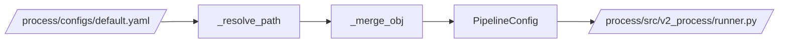

# config.py

## Purpose
This note documents `/process/src/v2_process/config.py`, which loads YAML and builds the typed `PipelineConfig` object.

## Where it sits in the pipeline
It sits between the entrypoint and the runner. Nothing downstream reads raw YAML directly; everything reads the dataclass config produced here.

## Inputs
- `/process/src/v2_process/config.py`
- `/process/configs/default.yaml`

## Outputs / side effects
Returns a `PipelineConfig` object. No data artifacts are written.

## How the code works
The loader works in three steps:

1. read YAML into a plain dictionary
2. resolve relative paths against the process project root
3. overlay YAML values onto dataclass defaults

Key helpers:
- `_resolve_path(...)` converts relative paths into project-root-relative absolute paths
- `_merge_obj(...)` overlays nested dictionaries onto dataclass instances
- `load_config(...)` builds the final `PipelineConfig`

## Core Code
Core config-loading logic.

```python
def _resolve_path(project_root: Path, value: str) -> Path:
    p = Path(value)
    return (project_root / p).resolve() if not p.is_absolute() else p


def _merge_obj(default_obj, overrides: dict):
    out = copy.deepcopy(default_obj)
    for key, value in overrides.items():
        setattr(out, key, value)  # overwrite only the supplied fields
    return out


def load_config(config_path: str | Path) -> PipelineConfig:
    raw = yaml.safe_load(cfg_path.read_text()) or {}
    project_root = cfg_path.parent.parent.resolve()
    inputs = InputPaths(
        stock_raw_csv=_resolve_path(project_root, raw['paths']['input']['stock_raw_csv']),
        macro_raw_csv=_resolve_path(project_root, raw['paths']['input']['macro_raw_csv']),
    )
```

## Math / logic
The logic is schema construction, not numerical transformation. Conceptually:

$$
\text{PipelineConfig} = \text{defaults} \oplus \text{YAML overrides}
$$

where $\oplus$ means “copy the default object, then overwrite only the keys provided in YAML.”

## Worked Example
If the YAML says:

```yaml
paths:
  input:
    stock_raw_csv: ../data/raw_stock_data.csv
```

and the config file lives in `/process/configs/default.yaml`, then `project_root` becomes `/process`, and the resolved stock path becomes:

```text
/process/../data/raw_stock_data.csv
```

which normalizes to the project-level `/data/raw_stock_data.csv` under `version_2`.

## Visual Flow


## What depends on it
- [run_process.py](02_run_process.md)
- [Contracts](06_src_v2_process_contracts.md)
- [Runner](09_src_v2_process_runner.md)

## Important caveats / assumptions
- The loader assumes the config file lives under `/process/configs`, because it derives `project_root` from `cfg_path.parent.parent`.
- There is no config-include or environment-variable expansion logic in the active implementation.

## Linked Notes
- [Process config](03_configs_default_yaml.md)
- [Contracts](06_src_v2_process_contracts.md)
- [Runner](09_src_v2_process_runner.md)
