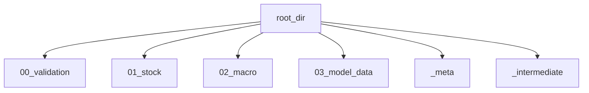

# paths.py

## Purpose
This note documents `/process/src/v2_process/paths.py`, which defines the output-path contract for the process pipeline.

## Where it sits in the pipeline
It sits between configuration and stage execution. The runner calls `build_output_paths(...)` once, and every stage then writes into those agreed locations.

## Inputs
- `/process/src/v2_process/paths.py`
- `PipelineConfig.outputs.root_dir`

## Outputs / side effects
Creates the process output directories if they do not exist and returns an `OutputPaths` object.

## How the code works
`OutputPaths` names every main location used by the pipeline. That includes:
- high-level output folders (`00_validation`, `01_stock`, `02_macro`, `03_model_data`, `_meta`, `_intermediate`)
- artifact file paths inside those folders

`build_output_paths(...)` creates the folders and returns the path bundle.

## Core Code
```python
@dataclass
class OutputPaths:
    root: Path
    out_00: Path
    out_01: Path
    out_02: Path
    out_03: Path
    meta: Path
    intermediate: Path
    transformed_stock: Path
    clean_stock: Path
    macro_base: Path
    model_data: Path


def build_output_paths(config: PipelineConfig) -> OutputPaths:
    root = config.outputs.root_dir
    out_00 = root / '00_validation'
    out_01 = root / '01_stock'
    out_02 = root / '02_macro'
    out_03 = root / '03_model_data'
```

## Math / logic
No numerical logic lives here. This is a path-contract layer.

## Worked Example
When `root_dir = ./outputs`, the transformed stock path becomes:

```text
/process/outputs/_intermediate/stock_transformed.csv
```

and the final handoff artifact becomes:

```text
/process/outputs/03_model_data/daily_model_data.csv
```

## Visual Flow


## What depends on it
- [Runner](09_src_v2_process_runner.md)
- all stage notes, because every stage writes through these path definitions

## Important caveats / assumptions
- The path contract is part of the public behavior of `/process`; if a filename changes here, downstream docs and notebook expectations change too.

## Linked Notes
- [Process config](03_configs_default_yaml.md)
- [Runner](09_src_v2_process_runner.md)
- [Transform stock stage](11_src_v2_process_stages_transform_stock.md)
- [Build model data stage](15_src_v2_process_stages_build_model_data.md)
