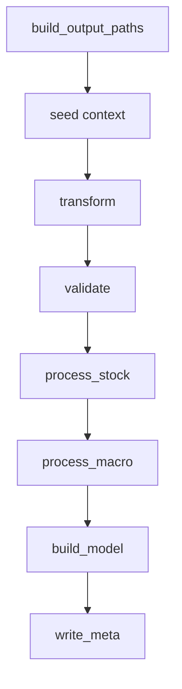

# runner.py

## Purpose
This note documents `/process/src/v2_process/runner.py`, the orchestration layer that executes the active process stage sequence.

## Where it sits in the pipeline
It is the core controller of `/process`. The entrypoint passes it a typed config, and the runner:
- builds output paths
- seeds the shared context
- executes stages in order
- records timings and outcomes
- writes metadata at the end

## Inputs
- `/process/src/v2_process/runner.py`
- `PipelineConfig`
- optional stage subset from the entrypoint

## Outputs / side effects
Indirect outputs:
- all stage artifacts through the stage functions
Direct outputs:
- `run_manifest.json`
- `stage_timings.csv`
- `quality_gates.csv`

## How the code works
The runner defines:
- `STAGE_ORDER`
- `STAGE_FUNCS`

Then `run_pipeline(...)` does the following:
1. build `OutputPaths`
2. create the initial `context`
3. loop over stages
4. time each stage
5. merge stage output paths into `context`
6. append a `StageResult`
7. on error, either stop or continue depending on config
8. finalize metadata with `quality_report.write_meta(...)`

## Core Code
Core stage loop.

```python
STAGE_ORDER = ['transform', 'validate', 'process_stock', 'process_macro', 'build_model']

for stage in stages:
    logger.info('Running stage: %s', stage)
    fn = STAGE_FUNCS[stage]
    t0 = time.time()
    try:
        out = fn(config=config, paths=paths, context=context)   # execute stage
        seconds = time.time() - t0
        context.update(out.get('outputs', {}))                  # pass artifacts forward
        stage_results.append(StageResult(
            stage=stage,
            ok=True,
            seconds=seconds,
            outputs=out.get('outputs', {}),
            metrics=out.get('metrics', {}),
            warnings=out.get('warnings', []),
            errors=[],
        ))
    except Exception as exc:
        stage_results.append(StageResult(stage=stage, ok=False, seconds=time.time() - t0, errors=[str(exc)]))
        if not config.runtime.continue_on_error:
            break
```

## Math / logic
The key runner logic is control flow, not model math. The most important invariant is:

$$
\text{context}_{t+1} = \text{context}_t \cup \text{stage outputs}_t
$$

This means each stage can pass artifact paths to the next stage without hard-coding discovery logic.

## Worked Example
At the start of a run, `context` contains only:
- `stock_raw_csv`
- `macro_raw_csv`

After `transform`, `context` also contains:
- `stock_transformed_csv`

After `process_stock`, it additionally contains:
- `stock_clean_csv`
- `stock_clean_summary`

After `build_model`, it finally contains:
- `model_data_csv`
- `macro_lagged_csv`
- `macro_lag_diag_csv`

That is the lineage that later appears in `_meta/run_manifest.json`.

## Visual Flow


## What depends on it
- [run_process.py](02_run_process.md)
- [Quality report stage](16_src_v2_process_stages_quality_report.md)
- all stage notes, because the runner determines their execution order

## Important caveats / assumptions
- The active stage order stops at `build_model`. There is no split stage, FF-factor stage, or benchmark stage in the current `/process` pipeline.
- Error handling is intentionally simple: stop on first failure unless `continue_on_error=True`.

## Linked Notes
- [Pipeline map](00_version_2_process_pipeline_map.md)
- [Config loader](05_src_v2_process_config.md)
- [Paths](08_src_v2_process_paths.md)
- [Stage registry](10_src_v2_process_stages___init__.md)
- [Quality report stage](16_src_v2_process_stages_quality_report.md)
