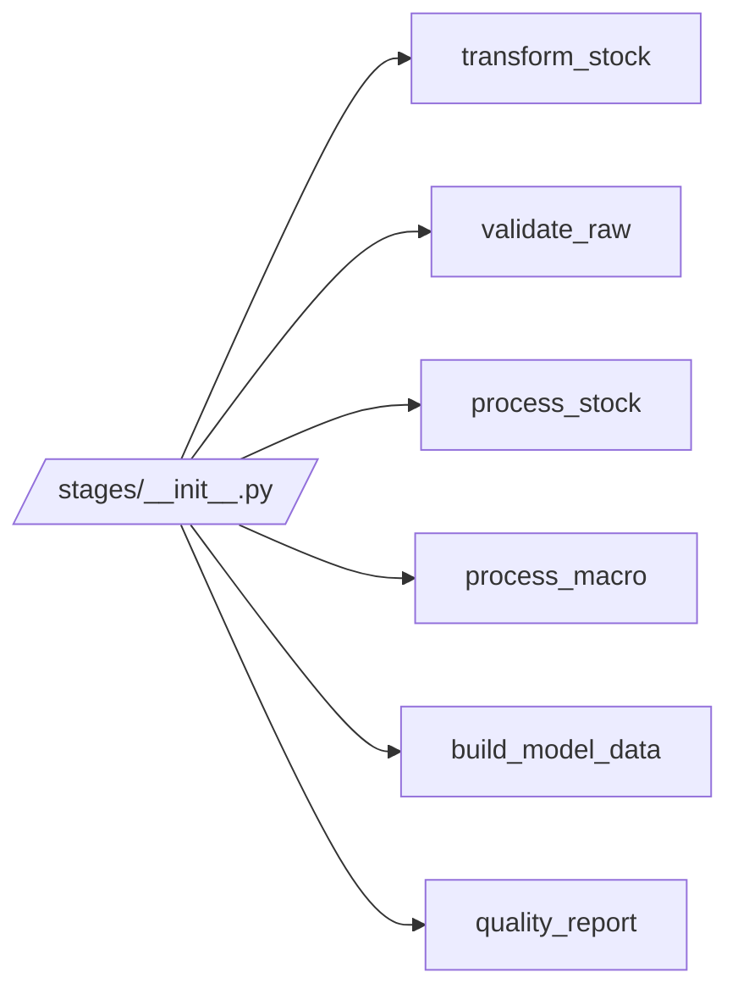

# stages/__init__.py

## Purpose
This note documents `/process/src/v2_process/stages/__init__.py`, the stage import registry.

## Where it sits in the pipeline
It sits between the stage modules and the runner. It does not transform data itself; it only centralizes stage-module imports.

## Inputs
- `/process/src/v2_process/stages/__init__.py`

## Outputs / side effects
No artifacts. It re-exports the stage modules.

## How the code works
The file imports:
- `transform_stock`
- `validate_raw`
- `process_stock`
- `process_macro`
- `build_model_data`
- `quality_report`

This makes the stage namespace easier to import from one place.

## Core Code
```python
from . import build_model_data, process_macro, process_stock, quality_report, transform_stock, validate_raw
```

## Math / logic
No numerical logic lives here.

## Worked Example
Without this registry, the runner would need separate import statements spread across files. With it, stage modules are grouped under one package namespace.

## Visual Flow


## What depends on it
- [Runner](09_src_v2_process_runner.md)

## Important caveats / assumptions
- This file is organizational only. All real stage behavior lives in the stage modules themselves.

## Linked Notes
- [Runner](09_src_v2_process_runner.md)
- [Transform stock stage](11_src_v2_process_stages_transform_stock.md)
- [Validate raw stage](12_src_v2_process_stages_validate_raw.md)
- [Process stock stage](13_src_v2_process_stages_process_stock.md)
- [Process macro stage](14_src_v2_process_stages_process_macro.md)
- [Build model data stage](15_src_v2_process_stages_build_model_data.md)
