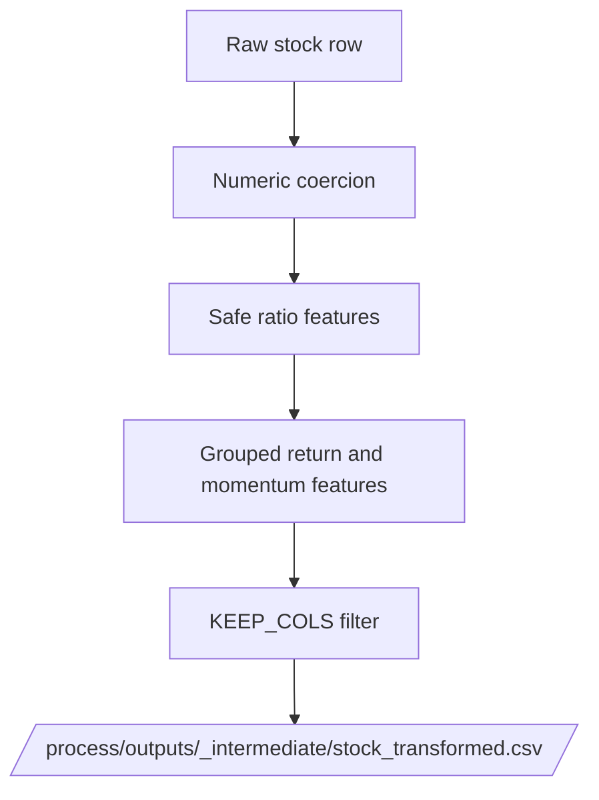

# transform_stock.py

## Purpose
This note documents `/process/src/v2_process/stages/transform_stock.py`, the first stock-data transformation stage.

## Where it sits in the pipeline
It is the first active stock stage after raw CSV ingestion. Its job is to normalize stock fields, coerce numeric values, and engineer the first batch of stock characteristics before any hole-date or calendar reconstruction logic is applied.

## Inputs
- `/data/raw_stock_data.csv`
- `CleaningConfig` indirectly, via downstream expectations

## Outputs / side effects
Writes:
- `/process/outputs/_intermediate/stock_transformed.csv`

Returns metrics such as:
- number of rows
- number of tickers
- number of columns kept

## How the code works
The stage follows this sequence:
1. load raw stock CSV
2. parse `Date`
3. drop rows without `Ticker` or `Date`
4. sort by `Ticker, Date`
5. coerce numeric-like columns to numeric where practical
6. engineer canonical stock features
7. keep only the columns needed downstream
8. replace `inf`/`-inf` with `NaN`
9. write the transformed stock file

### Main engineered features
The stage uses raw accounting and market-value inputs to build characteristics such as:
- `bm`
- `ep`
- `cfp`
- `dy`
- `lev`
- `cash_ratio`
- `roeq`
- `gma`
- `mom1m`, `mom6m`, `mom12m`, `mom36m`
- `agr`
- `chcsho`
- `chinv`
- `pchsale_pchinvt`
- `age`
- `turn`
- `std_turn`
- `maxret`
- `idiovol`

## Core Code
Core feature-engineering block.

```python
# Safe division prevents divide-by-zero from creating misleading infinities.
def _safe_div(a, b):
    out = np.full(len(a), np.nan, dtype=float)
    good = np.isfinite(b) & (np.abs(b) > 1e-12)
    out[good] = np.asarray(a, float)[good] / np.asarray(b, float)[good]
    return out

# Value and profitability-style features.
df['bm'] = _safe_div(equity, mcap)          # book-to-market
df['ep'] = _safe_div(ni, mcap)              # earnings-to-price proxy
df['cfp'] = _safe_div(cfo, mcap)            # cash-flow-to-price proxy
df['dy'] = _safe_div(df.get('Div_Yield', np.nan), 100.0)
df['lev'] = _safe_div(debt, assets)
df['cash_ratio'] = _safe_div(cash, assets)
df['roeq'] = _safe_div(ni, equity)
df['gma'] = _safe_div(gp, assets)

# Daily returns and multi-horizon price momentum.
grp = df.groupby('Ticker', sort=False)
df['ret_1d'] = grp['Price'].pct_change()
df['mom1m'] = grp['Price'].pct_change(21)
df['mom6m'] = grp['Price'].pct_change(126)
```

## Math / logic
Core feature formulas implemented in the stage:

$$
bm = \frac{\text{Equity}}{\text{Market\_Cap}}
$$

$$
ep = \frac{\text{Net\_Income}}{\text{Market\_Cap}}
$$

$$
cfp = \frac{\text{Oper\_CF}}{\text{Market\_Cap}}
$$

$$
lev = \frac{\text{Debt}}{\text{Assets}}
$$

$$
cash\_ratio = \frac{\text{Cash}}{\text{Assets}}
$$

$$
roeq = \frac{\text{Net\_Income}}{\text{Equity}}
$$

$$
gma = \frac{\text{Gross\_Profit}}{\text{Assets}}
$$

Price momentum is implemented as grouped percentage change over trading-day windows:

$$
mom_{h} = \frac{P_t}{P_{t-h}} - 1
$$

with horizons approximately equal to:
- $h=21$ days for `mom1m`
- $h=126$ days for `mom6m`
- $h=252$ days for `mom12m`
- $h=756$ days for `mom36m`

## Worked Example
Real row from the current transformed panel for `AAA VM Equity` on `2016-11-25`:

- `Market_Cap = 1,551,809.5894`
- `Equity = 898,320.8659`
- `Net_Income = 38,673.8558`
- `Oper_CF = 24,283.5543`
- `Assets = 2,455,694.8764`
- `Gross_Profit = 82,792.4534`

The stage computes:

$$
bm \approx \frac{898320.8659}{1551809.5894} = 0.578886
$$

$$
ep \approx \frac{38673.8558}{1551809.5894} = 0.024922
$$

$$
cfp \approx \frac{24283.5543}{1551809.5894} = 0.015649
$$

$$
gma \approx \frac{82792.4534}{2455694.8764} = 0.033714
$$

Those match the values visible in the current transformed/cleaned outputs.

## Visual Flow


## What depends on it
- [Validate raw stage](12_src_v2_process_stages_validate_raw.md)
- [Process stock stage](13_src_v2_process_stages_process_stock.md)

## Important caveats / assumptions
- This stage uses the observed daily price sequence as-is; the true valid-calendar reconstruction happens later in `process_stock.py`.
- `dy` depends on `Div_Yield` being available; when it is missing, `dy` remains missing and is handled later.
- `age` is a simple trading-row counter divided by `252`; it is not a listing-date lookup.

## Linked Notes
- [Pipeline map](00_version_2_process_pipeline_map.md)
- [Validate raw stage](12_src_v2_process_stages_validate_raw.md)
- [Process stock stage](13_src_v2_process_stages_process_stock.md)
