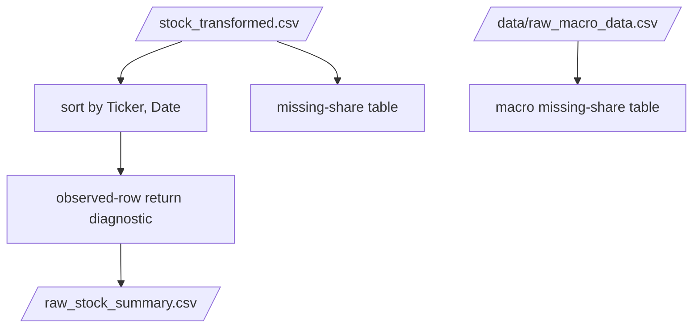

# validate_raw.py

## Purpose
This note documents `/process/src/v2_process/stages/validate_raw.py`, the validation-only stage that summarizes stock and macro input quality.

## Where it sits in the pipeline
It runs after `transform_stock.py` and before stock/macro processing. It does not mutate the transformed stock panel; it only writes diagnostics.

## Inputs
- transformed stock file from `/process/outputs/_intermediate/stock_transformed.csv` when available
- raw macro file from `/data/raw_macro_data.csv`

## Outputs / side effects
Writes:
- `/process/outputs/00_validation/raw_stock_summary.csv`
- `/process/outputs/00_validation/raw_stock_missing_share.csv`
- `/process/outputs/00_validation/raw_macro_missing_share.csv`

## How the code works
The stage:
1. reads transformed stock if available, otherwise raw stock
2. sorts by `Ticker, Date`
3. computes one-step observed-price returns when `Price` exists
4. measures:
   - total rows
   - total tickers
   - duplicate `Ticker, Date` rows
   - zero-return share
5. writes a compact stock summary table
6. writes full missing-share tables for stock and macro inputs

## Core Code
Core validation logic.

```python
stock = pd.read_csv(stock_path, parse_dates=['Date'])
stock = stock.sort_values(['Ticker', 'Date'])

if 'Price' in stock.columns:
    stock['ret'] = stock.groupby('Ticker', sort=False)['Price'].pct_change()
    zero_ret_share = float((stock['ret'] == 0).mean())
else:
    zero_ret_share = np.nan

summary = pd.DataFrame([
    {'metric': 'n_rows', 'value': float(len(stock))},
    {'metric': 'n_tickers', 'value': float(stock['Ticker'].nunique())},
    {'metric': 'dup_ticker_date_rows', 'value': float(stock.duplicated(['Ticker', 'Date']).sum())},
    {'metric': 'zero_return_share', 'value': float(zero_ret_share)},
])
```

## Math / logic
The main diagnostic statistic is the observed-row zero-return share:

$$
\text{zero\_return\_share} = \frac{1}{N}\sum_{i=1}^{N} \mathbf{1}(ret_i = 0)
$$

This is not the final modeling target; it is a diagnostic for how “sticky” or illiquid the observed daily price series looks.

## Worked Example
Current validation summary from the active outputs:

- `n_rows = 2,442,773`
- `n_tickers = 699`
- `dup_ticker_date_rows = 0`
- `zero_return_share = 0.3246703644`

Interpretation:
- the transformed stock panel is very large and has no duplicate ticker-date rows
- about `32.5%` of observed daily returns are zero at this early validation stage

## Visual Flow


## What depends on it
This stage is mainly for human review. Downstream stages do not rely on its outputs to run.

## Important caveats / assumptions
- The stock validation summary typically targets the transformed stock file, not the untouched raw stock file.
- The zero-return share here is an observed-row diagnostic, not the final valid-calendar return series used later.

## Linked Notes
- [Pipeline map](00_version_2_process_pipeline_map.md)
- [Transform stock stage](11_src_v2_process_stages_transform_stock.md)
- [Process stock stage](13_src_v2_process_stages_process_stock.md)
- [Process notebook](17_notebooks_00_run_and_review_process.md)
