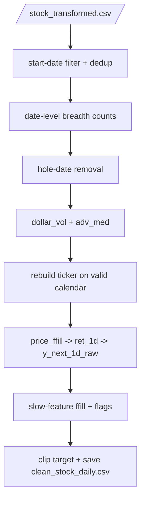

# process_stock.py

## Purpose
This note documents `/process/src/v2_process/stages/process_stock.py`, the core stock-cleaning stage of the active process pipeline.

## Where it sits in the pipeline
It sits after stock feature engineering and before macro merging. This stage does the heavy lifting for daily stock cleanliness and target construction:
- start-date filtering
- hole-date removal
- liquidity proxy construction
- valid-calendar rebuild per ticker
- clipped next-day target creation
- slow-feature forward fill and missingness flags

## Inputs
- transformed stock file from `/process/outputs/_intermediate/stock_transformed.csv`
- cleaning thresholds from `/process/configs/default.yaml`

## Outputs / side effects
Writes:
- `/process/outputs/01_stock/clean_stock_daily.csv`
- `/process/outputs/01_stock/clean_stock_summary.csv`

Returns output paths through context:
- `stock_clean_csv`
- `stock_clean_summary`

## How the code works
The stage has five major blocks.

### 1. Initial cleanup
- read transformed stock
- drop rows missing `Ticker` or `Date`
- keep only rows after `start_date`
- sort by `Ticker, Date`
- deduplicate `Ticker, Date`

### 2. Hole-date removal
The stage counts how many tickers have a non-missing price on each date and compares that to a rolling-median baseline. Dates with too little breadth are removed.

### 3. Liquidity proxies
It computes:
- `dollar_vol = Price * Volume`
- `adv_med` = 60-day rolling median of `dollar_vol` with at least 20 observations

### 4. Valid-calendar rebuild by ticker
For each ticker, it rebuilds the ticker on the shared valid date calendar between the ticker’s first and last observed date. Then it creates:
- `is_observed_price`
- `price_ffill`
- `ret_1d`
- `y_next_1d_raw`
- `calendar_gap_flag`

It also forward-fills slow accounting features with a `252`-day staleness cap and adds missingness flags.

### 5. Final daily stock output
After the ticker-specific helper returns only observed rows, the stage writes the clean stock panel and a summary table.

## Core Code
Core valid-calendar and target logic.

```python
def _build_ticker_calendar(g, valid_dates, stale_limit):
    # Build this ticker on the shared valid market-date calendar.
    full_dates = valid_dates[(valid_dates >= g['Date'].min()) & (valid_dates <= g['Date'].max())]
    cal = pd.DataFrame({'Date': full_dates})
    out = cal.merge(g, on='Date', how='left')
    out['Ticker'] = g['Ticker'].iloc[0]

    # Mark whether the closing price was truly observed on that date.
    out['is_observed_price'] = out['Price'].notna().astype(int)

    # Forward-fill price only for return construction, not for raw storage.
    out['price_ffill'] = out['Price'].ffill()
    out['ret_1d'] = out['price_ffill'].pct_change()
    out['y_next_1d_raw'] = out['ret_1d'].shift(-1)

    # Flag dates where an observed quote follows one or more calendar gaps.
    prev_obs = out['is_observed_price'].shift(1).fillna(1).astype(int)
    out['calendar_gap_flag'] = ((out['is_observed_price'] == 1) & (prev_obs == 0)).astype(int)

    # Slow features can be carried forward, but only for a limited stale window.
    for col in SLOW_FEATURES:
        if col in out.columns:
            out[f'{col}_missing_flag'] = out[col].isna().astype(int)
            out[col] = out[col].ffill(limit=stale_limit)

    # Keep only rows with observed prices in the final daily stock output.
    out = out.loc[out['is_observed_price'] == 1].copy()
    out['ret_outlier_flag'] = out['ret_1d'].abs() > 1.0
    out['y_clip_flag'] = out['y_next_1d_raw'].abs() > 0.50
    out['y_next_1d'] = out['y_next_1d_raw'].clip(-0.50, 0.50)
    return out
```

## Math / logic
### Hole-date removal
Let $\text{count}_t$ be the number of tickers with a non-missing price on date $t$.

Let $\text{baseline}_t$ be the rolling median of $\text{count}$ over the previous `roll_days`.

Then a date is kept if:

$$
\text{count}_t \ge \text{min\_rel} \times \text{baseline}_t
$$

or, if the baseline is unavailable:

$$
\text{count}_t \ge \text{min\_stocks\_early}
$$

### Liquidity proxies

$$
\text{dollar\_vol}_{i,t} = \text{Price}_{i,t} \times \text{Volume}_{i,t}
$$

$$
adv\_med_{i,t} = \operatorname{median}\left(\text{dollar\_vol}_{i,t-59:t}\right)
$$

with at least `liq_minp` observations.

### Calendar-step returns
After price forward-fill on the valid ticker calendar:

$$
ret_{i,t}^{1d} = \frac{P^{ffill}_{i,t}}{P^{ffill}_{i,t-1}} - 1
$$

$$
y^{raw}_{i,t+1} = ret^{1d}_{i,t+1}
$$

### Clipped target

$$
y_{i,t+1} = \min\{0.5, \max[-0.5, y^{raw}_{i,t+1}]\}
$$

## Worked Example
Real output rows for `AAA VM Equity` from the current clean stock file:

| Date | Price | is_observed_price | price_ffill | ret_1d | y_next_1d | calendar_gap_flag |
| --- | ---: | ---: | ---: | ---: | ---: | ---: |
| 2016-11-25 | 19940.323 | 1 | 19940.323 | NaN | -0.016722 | 1 |
| 2016-11-28 | 19606.873 | 1 | 19606.873 | -0.016722 | 0.000000 | 0 |
| 2016-11-29 | 19606.873 | 1 | 19606.873 | 0.000000 | 0.000000 | 0 |
| 2016-11-30 | 19606.873 | 1 | 19606.873 | 0.000000 | -0.040816 | 0 |
| 2016-12-01 | 18806.592 | 1 | 18806.592 | -0.040816 | 0.000000 | 0 |

This shows the stage’s key design choice:
- returns are calculated on the valid calendar, not just the next observed quote date
- the next-day target is then the following calendar-step return

Current summary from `clean_stock_summary.csv`:
- rows: `2,252,579`
- tickers: `699`
- dropped hole dates: `130`
- clip share: `0.000144`
- zero-return share: `0.351842`
- calendar-gap-flag share: `0.000316`

## Visual Flow


## What depends on it
- [Build model data stage](15_src_v2_process_stages_build_model_data.md)
- the process notebook and quality review notes

## Important caveats / assumptions
- `target_clip` and `outlier_abs_ret_flag` exist in config, but the helper currently hard-codes `0.50` and `1.0`.
- Slow features are forward-filled ticker-by-ticker; fast trading variables are not.
- The final output keeps only observed-price rows, even though the internal return construction uses an expanded valid-date calendar.

## Linked Notes
- [Pipeline map](00_version_2_process_pipeline_map.md)
- [Process config](03_configs_default_yaml.md)
- [Validate raw stage](12_src_v2_process_stages_validate_raw.md)
- [Process macro stage](14_src_v2_process_stages_process_macro.md)
- [Build model data stage](15_src_v2_process_stages_build_model_data.md)
