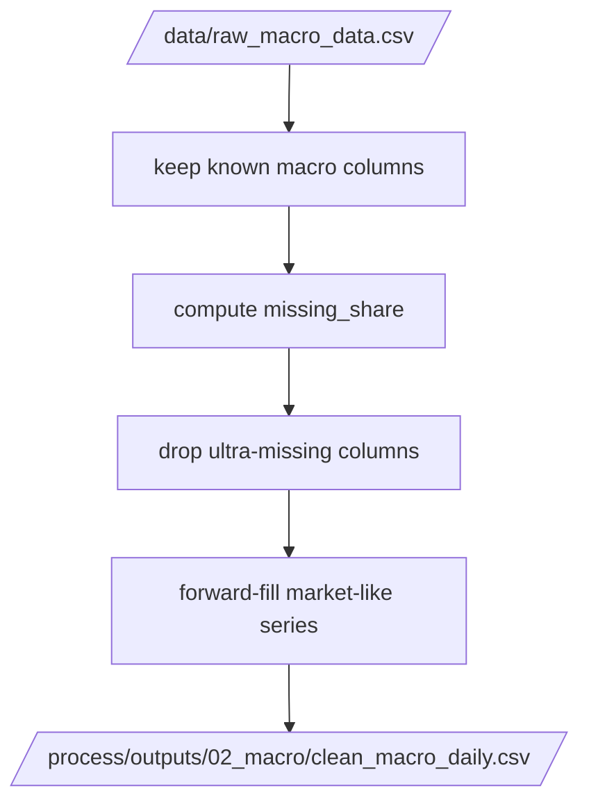

# process_macro.py

## Purpose
This note documents `/process/src/v2_process/stages/process_macro.py`, the stage that cleans and standardizes the daily macro panel before it is lagged and merged into stock rows.

## Where it sits in the pipeline
It runs after stock processing and before the stock-macro merge. It is the only active stage in `/process` that decides which macro series are retained and which are forward-filled.

## Inputs
- `/data/raw_macro_data.csv`
- macro settings from `/process/configs/default.yaml`

## Outputs / side effects
Writes:
- `/process/outputs/02_macro/clean_macro_daily.csv`
- `/process/outputs/02_macro/macro_missing_share.csv`

Returns through context:
- `macro_base_csv`
- `macro_missing_share`

## How the code works
The stage:
1. reads the raw macro CSV
2. parses and sorts `Date`
3. deduplicates by `Date`
4. keeps only known macro columns from `KEEP_MACRO_COLS`
5. computes missing-share by column
6. drops columns whose missing share exceeds `max_missing_share`
7. forward-fills only the market-like subset listed in `MARKET_LIKE`
8. writes the clean macro daily file

## Core Code
Core macro-filtering logic.

```python
keep = ['Date'] + [c for c in KEEP_MACRO_COLS if c in macro.columns]
macro = macro[keep].copy()

missing = macro.isna().mean().rename('missing_share').reset_index().rename(columns={'index': 'column'})
missing.to_csv(paths.macro_missing_share, index=False)

keep_cols = ['Date'] + [
    c for c in macro.columns
    if c == 'Date' or missing.loc[missing['column'] == c, 'missing_share'].iloc[0] <= config.macro.max_missing_share
]
macro = macro[keep_cols].copy()

for c in [c for c in MARKET_LIKE if c in macro.columns]:
    macro[c] = macro[c].ffill()  # carry forward market-observed levels
```

## Math / logic
The stage uses column-wise missing share:

$$
\text{missing\_share}_j = \frac{1}{T}\sum_{t=1}^{T} \mathbf{1}(x_{t,j}\text{ is missing})
$$

A macro column is dropped if:

$$
\text{missing\_share}_j > \text{max\_missing\_share}
$$

Only the `MARKET_LIKE` subset is forward-filled, because these are treated as market-observed series rather than event-based release variables.

## Worked Example
Current missing-share snapshot from the active output:

| Column | Missing share |
| --- | ---: |
| `US_GDP_QoQ` | 0.984975 |
| `VN_CPI_YoY` | 0.966195 |
| `US_CPI_YoY` | 0.954926 |
| `VN_MoneySupply_M2` | 0.836175 |
| `VN_DIAMOND_INDEX` | 0.772754 |

Because `max_missing_share = 0.995`, these columns are still allowed to stay in the cleaned macro base even though some are extremely sparse.

This is an intentional design choice: very sparse macro/event series are allowed to survive into the later release-lag step rather than being dropped too early.

## Visual Flow


## What depends on it
- [Build model data stage](15_src_v2_process_stages_build_model_data.md)

## Important caveats / assumptions
- This stage does **not** apply release lags. That happens later in `build_model_data.py`.
- Event-style macro series can remain sparse here; they are not fully expanded until the lagging step.
- The high `max_missing_share` threshold means many sparse series remain in the clean macro base by design.

## Linked Notes
- [Pipeline map](00_version_2_process_pipeline_map.md)
- [Process config](03_configs_default_yaml.md)
- [Build model data stage](15_src_v2_process_stages_build_model_data.md)
