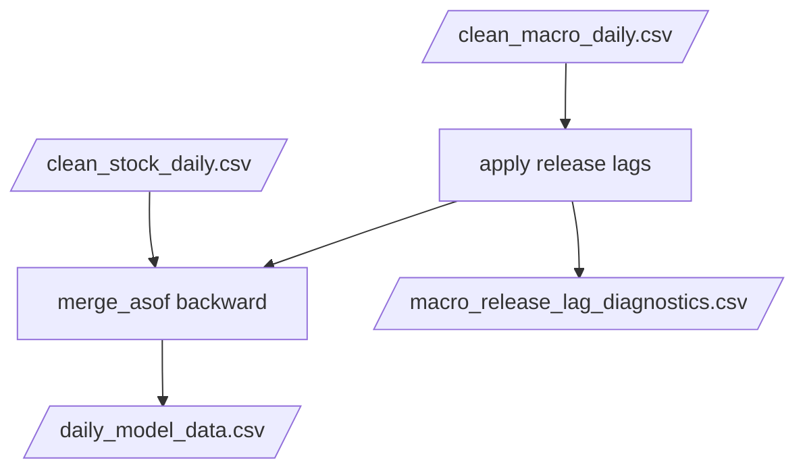

# build_model_data.py

## Purpose
This note documents `/process/src/v2_process/stages/build_model_data.py`, the bridge stage from cleaned daily stock and macro data into the final merged daily dataset used by the model pipeline.

## Where it sits in the pipeline
It is the final active stage of `/process`. It consumes the cleaned daily stock panel and the cleaned daily macro panel, applies macro release-lag logic, and writes the handoff artifact for `/model`.

## Inputs
- `/process/outputs/01_stock/clean_stock_daily.csv`
- `/process/outputs/02_macro/clean_macro_daily.csv`
- macro release-lag rules from `/process/configs/default.yaml`

## Outputs / side effects
Writes:
- `/process/outputs/03_model_data/macro_lagged_daily.csv`
- `/process/outputs/03_model_data/macro_release_lag_diagnostics.csv`
- `/process/outputs/03_model_data/daily_model_data.csv`

Returns through context:
- `macro_lagged_csv`
- `macro_lag_diag_csv`
- `model_data_csv`

## How the code works
The stage performs four jobs:

1. read and sort clean stock and macro daily inputs
2. keep only the known macro columns used by the project
3. shift configured event-style macro series to release dates
4. backward `merge_asof` the lagged macro panel onto the daily stock rows

### Release-lag logic
For each configured macro column with lag days:
- identify dates where the value changes
- shift the change event forward by the configured lag
- move any weekend release to the next business day
- reindex onto the full macro calendar and forward-fill

Columns without a configured lag are simply forward-filled on the full date index.

## Core Code
Core release-lag and merge logic.

```python
def _shift_events_to_release_dates(series: pd.Series, lag_days: int) -> pd.Series:
    s = series.dropna()
    changed = s.ne(s.shift(1))         # detect new information events
    event_dates = s.index[changed]
    shifted_dates = [_next_business_day(dt + pd.Timedelta(days=lag_days)) for dt in event_dates]
    return pd.Series(s.loc[event_dates].to_list(), index=pd.to_datetime(shifted_dates))


def _apply_release_lags_once(macro_df: pd.DataFrame, lag_rules: dict[str, int]):
    for col in macro_df.columns:
        if col in lag_rules:
            shifted = _shift_events_to_release_dates(macro_df[col], lag_rules[col])
            lagged_cols[col] = shifted
        else:
            lagged_cols[col] = macro_df[col]

merged = pd.merge_asof(
    stock.sort_values('Date'),
    macro_lagged.sort_values('Date'),
    on='Date',
    direction='backward',  # only use information available by that date
)
```

## Math / logic
The key information-timing rule is:

$$
X^{macro}_{t, used} = X^{macro}_{\tau} \quad \text{where } \tau \le t
$$

implemented through backward `merge_asof`, so each stock row on date $t$ only sees the latest lagged macro release available by that date.

For a lagged macro series with event date $e$ and configured lag $L$ days:

$$
\text{release date} = \text{next business day}(e + L)
$$

## Worked Example
Current first row of the active merged daily model data for `AAA VM Equity` on `2016-11-25` includes both stock fields and macro fields:

- stock side: `Price`, `Market_Cap`, `Volume`, `bm`, `mom12m`, `adv_med`, `y_next_1d`
- macro side: `US_Bond_10Y = 2.3572`, `US_Market_SP500 = 2213.35`, `US_RiskFree_3M = 0.4923`, `VN_Market_Index = 675.87`, regional indices, and more

That row exists because the stage found the most recent lagged macro record with `Date <= 2016-11-25` and merged it backward onto the stock row.

## Visual Flow


## What depends on it
Direct downstream consumer:
- the `/model` pipeline, starting with [monthly input preparation](../version_2_model_docs/11_src_v2_model_prepare_inputs.md) in the model manual pack

Within the process pack, this is the final transformation stage before metadata finalization.

## Important caveats / assumptions
- The stage assumes macro release-lag rules are defined only for the sparse event-style series that need them.
- Backward `merge_asof` is the core no-lookahead safeguard here.
- Rows before the first lagged macro date are dropped after the merge.

## Linked Notes
- [Pipeline map](00_version_2_process_pipeline_map.md)
- [Process config](03_configs_default_yaml.md)
- [Process stock stage](13_src_v2_process_stages_process_stock.md)
- [Process macro stage](14_src_v2_process_stages_process_macro.md)
- [Quality report stage](16_src_v2_process_stages_quality_report.md)
