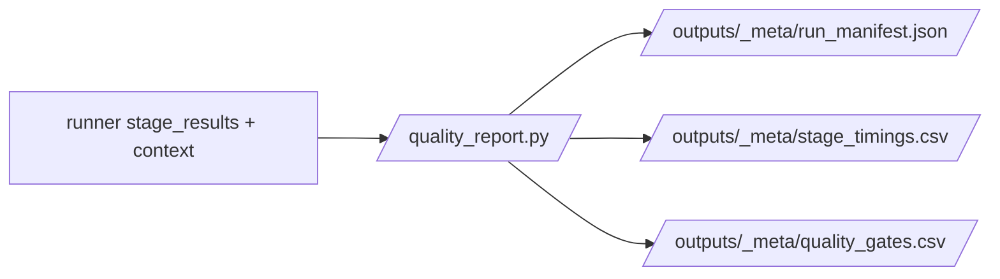

# quality_report.py

## Purpose
This note documents `/process/src/v2_process/stages/quality_report.py`, which finalizes the process run metadata.

## Where it sits in the pipeline
It is called by the runner after stage execution completes. It is not part of the main stage order, but it closes the run by writing manifests and quality-gate tables.

## Inputs
- `PipelineConfig`
- `OutputPaths`
- `config_path`
- `started_at`
- `stage_results`
- final `context`
- active `stage_order`

## Outputs / side effects
Writes:
- `/process/outputs/_meta/run_manifest.json`
- `/process/outputs/_meta/stage_timings.csv`
- `/process/outputs/_meta/quality_gates.csv`

## How the code works
The helper serializes the full run state:
- config path
- start and finish time
- requested stage order
- stage results
- final context

It also creates a small quality-gate table covering:
- whether all requested stages passed
- whether the core process outputs exist

## Core Code
```python
manifest = {
    'config_path': str(config_path),
    'started_at': started_at,
    'finished_at': _iso_now(),
    'stage_order': list(stage_order),
    'stage_results': [asdict(r) for r in stage_results],
    'context': context,
}

core_ok = all(Path(p).exists() for p in [
    context.get('raw_stock_summary', ''),
    context.get('stock_clean_csv', ''),
    context.get('macro_base_csv', ''),
    context.get('model_data_csv', ''),
])
```

## Math / logic
The quality-gate logic is binary:

$$
\text{all\_requested\_stages\_ok} = \mathbf{1}(\forall s,\; s.ok = \text{True})
$$

$$
\text{core\_outputs\_exist} = \mathbf{1}(\text{all required artifact paths exist})
$$

## Worked Example
After a successful run, the manifest records:
- the config path used
- the stage order actually run
- output artifact paths in `context`

This makes it possible to reconstruct which exact process outputs belong to which run.

## Visual Flow


## What depends on it
- [Runner](09_src_v2_process_runner.md)
- human reviewers using the process notebook or later manual checks

## Important caveats / assumptions
- The quality gates are intentionally lightweight; they verify core existence and stage success, not semantic correctness of every artifact.

## Linked Notes
- [Pipeline map](00_version_2_process_pipeline_map.md)
- [Runner](09_src_v2_process_runner.md)
