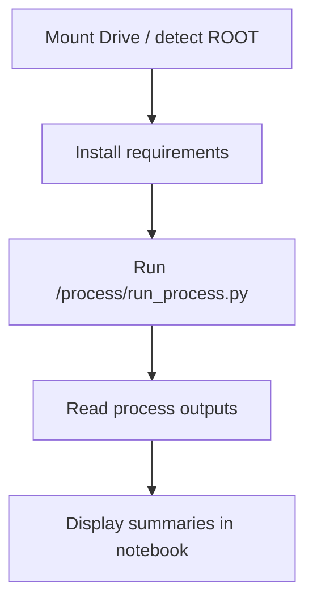

# 00_run_and_review_process.ipynb

## Purpose
This note documents `/process/notebooks/00_run_and_review_process.ipynb`, the notebook wrapper for running and reviewing the active process pipeline.

## Where it sits in the pipeline
It is an operator-facing layer above the process pipeline. The notebook does not implement the core transformations itself; it calls `run_process.py`, then reads the generated outputs back for review.

## Inputs
- `/process/notebooks/00_run_and_review_process.ipynb`
- `/process/run_process.py`
- `/process/configs/default.yaml`
- raw CSVs in `/data`

## Outputs / side effects
Indirect outputs:
- all normal `/process/outputs/...` artifacts, because the notebook runs the process pipeline

Notebook displays:
- raw stock summary
- clean stock summary
- top macro missingness rows
- head of `daily_model_data.csv`

## How the code works
The notebook has four practical sections:
1. mount Drive if running in Colab
2. resolve the process root (`/content/drive/MyDrive/version_2/process`, `/content/version_2/process`, or local fallback)
3. install requirements
4. run `run_process.py --stages all`
5. display core output tables for quick review

Unlike an older pattern, the current notebook **does not change the working directory manually**; it only passes `cwd=ROOT` to the subprocess call.

## Core Code
Core execution cell.

```python
root_candidates = [
    Path('/content/drive/MyDrive/version_2/process'),
    Path('/content/version_2/process'),
    Path.cwd().resolve().parents[0],
]
ROOT = next(path for path in root_candidates if path.exists())
CONFIG = ROOT / 'configs' / 'default.yaml'

cmd = [sys.executable, str(ROOT / 'run_process.py'), '--config', str(CONFIG), '--stages', 'all']
proc = subprocess.Popen(cmd, cwd=ROOT, stdout=subprocess.PIPE, stderr=subprocess.STDOUT, text=True, bufsize=1)
```

## Math / logic
No transformation math lives in the notebook. It is an execution and inspection wrapper.

## Worked Example
Current review cell outputs from the active run include:
- `raw_stock_summary.csv` with `2,442,773` rows and `699` tickers
- `clean_stock_summary.csv` with `2,252,579` rows after stock cleaning
- top 20 macro missing-share rows
- first 20 rows of `daily_model_data.csv`

That makes the notebook a fast smoke-test surface for data readiness.

## Visual Flow


## What depends on it
Human users depend on this notebook when they want a quick run-review loop without opening a terminal.

## Important caveats / assumptions
- The notebook is not the authoritative implementation path; it is a wrapper around the CLI pipeline.
- It assumes the raw data files already exist under `/data` relative to the `version_2` root.

## Linked Notes
- [Pipeline map](00_version_2_process_pipeline_map.md)
- [run_process.py](02_run_process.md)
- [Process config](03_configs_default_yaml.md)
- [Validate raw stage](12_src_v2_process_stages_validate_raw.md)
- [Process stock stage](13_src_v2_process_stages_process_stock.md)
- [Build model data stage](15_src_v2_process_stages_build_model_data.md)
